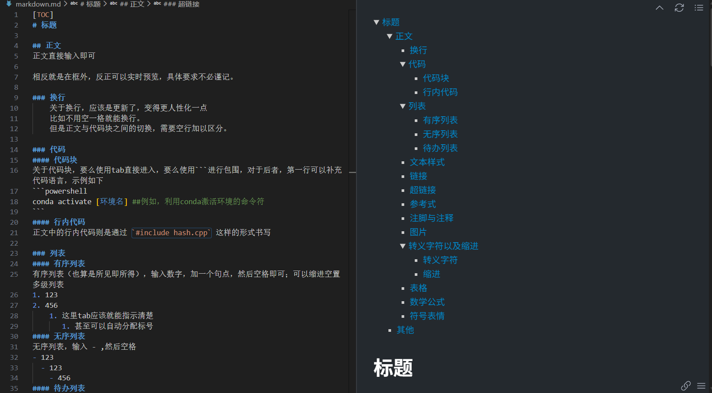
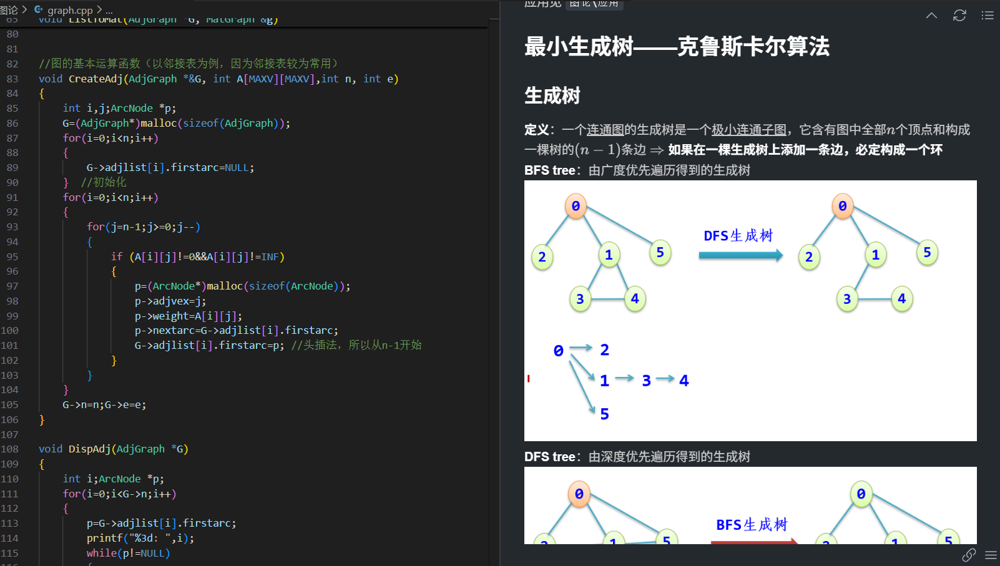

# 项目说明
本项目是作者在期末复习数据结构的时候，突发奇想，想利用markdown做一份数据结构的笔记，所以除了和数据结构及其算法相关的内容外，还有一份markdown的使用笔记``markdown.md``。[搭建Markdown写作环境(基于vscode)](https://www.cnblogs.com/Proaes/p/18857922)、[使用 VSCode 编写 Markdown 文件](https://blog.csdn.net/weixin_49272453/article/details/147440391)本人也是学习该博主的markdown指南，大家也可以去该网址进一步学习

而关于数据结构及其算法相关的内容，每个目录下都分为源码``.cpp``、知识点``.md``、和应用``.\应用``三部分供大家参考和学习

作者本人使用的是vscode，若是想除了C/C++和markdown一些必须的扩展外，没用多余的环境配置，故如果是像我一样的纯新手，也可以借此机会学着去配置的自己的vscode

最后由于作者不是计算机专业的学生，所以内容可能不甚全面，也可能存在一些不合理、不正确之处，希望大家可以及时发现，不被误导，也欢迎大家一起来修补这份数据结构笔记

若有任何问题和建议，可以联系我的邮箱：2812035873@qq.com