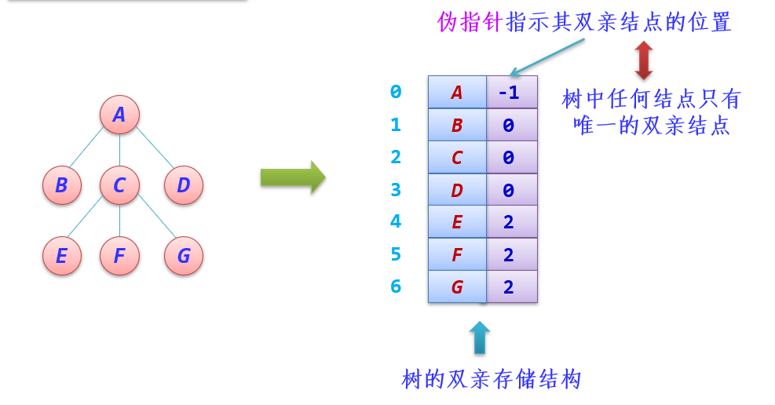
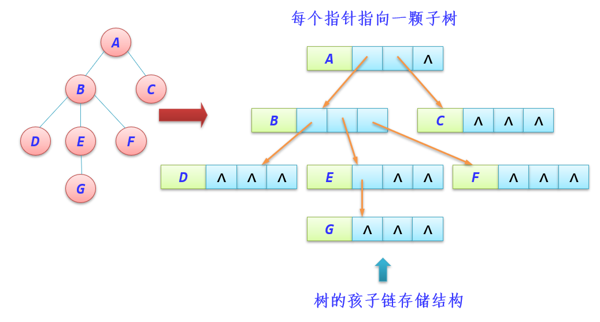
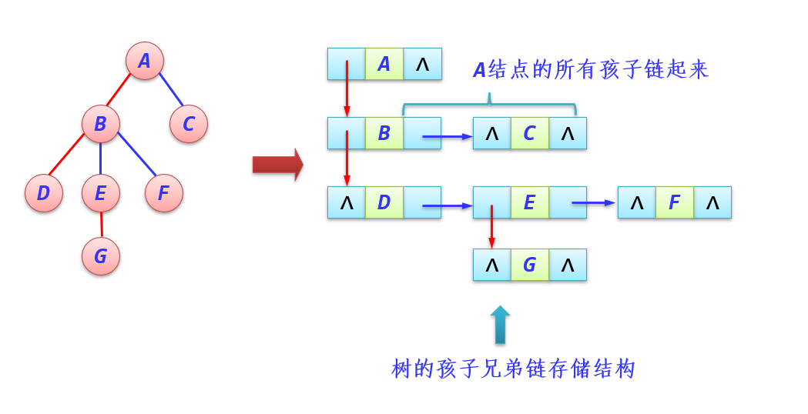
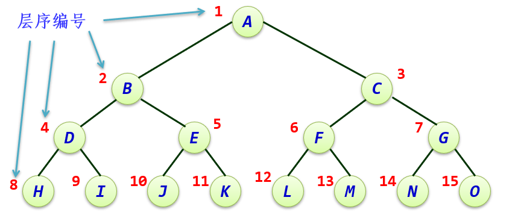
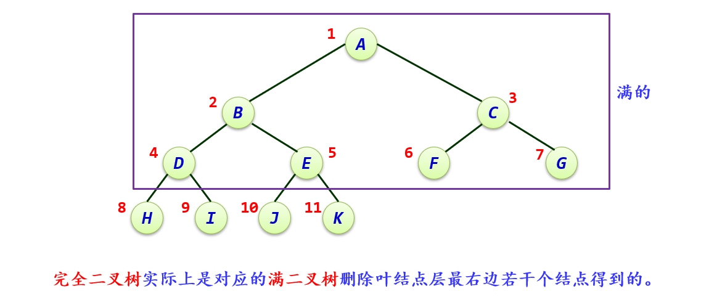
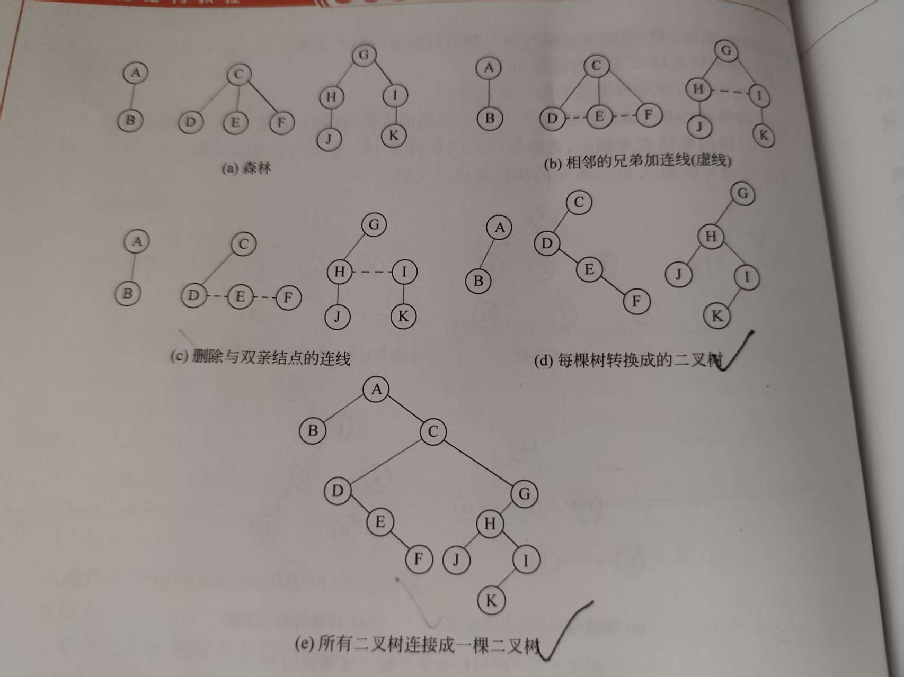
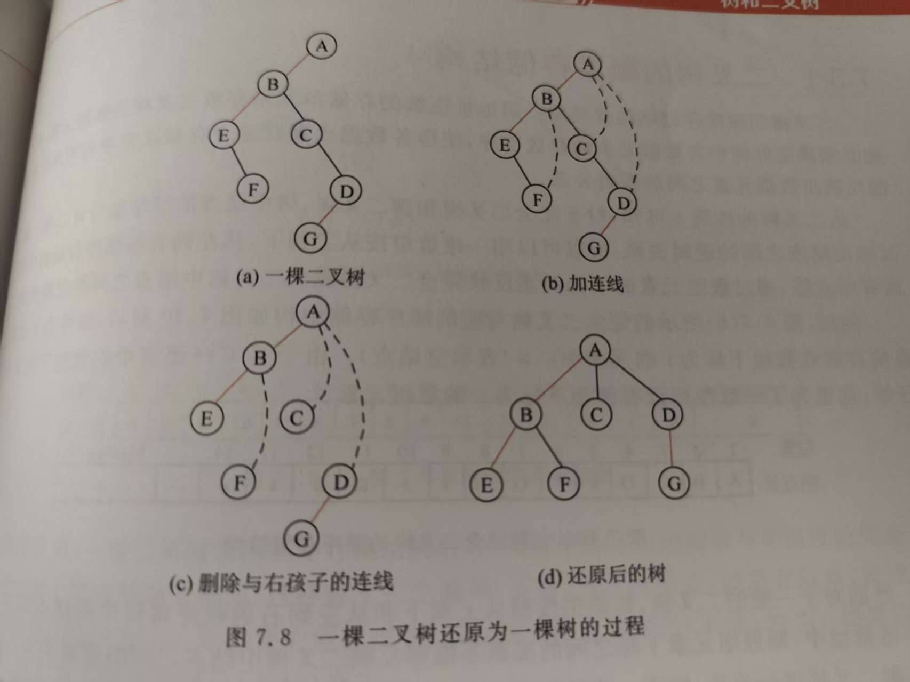
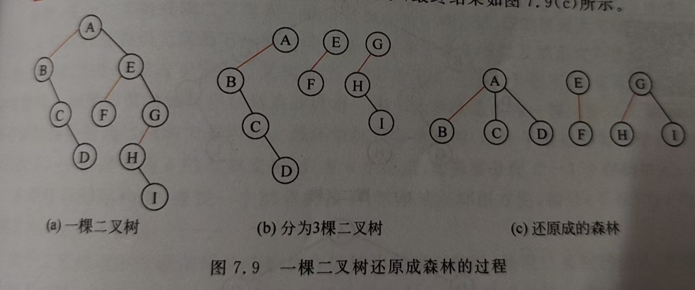
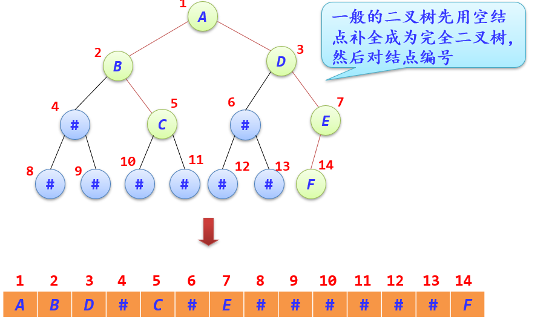
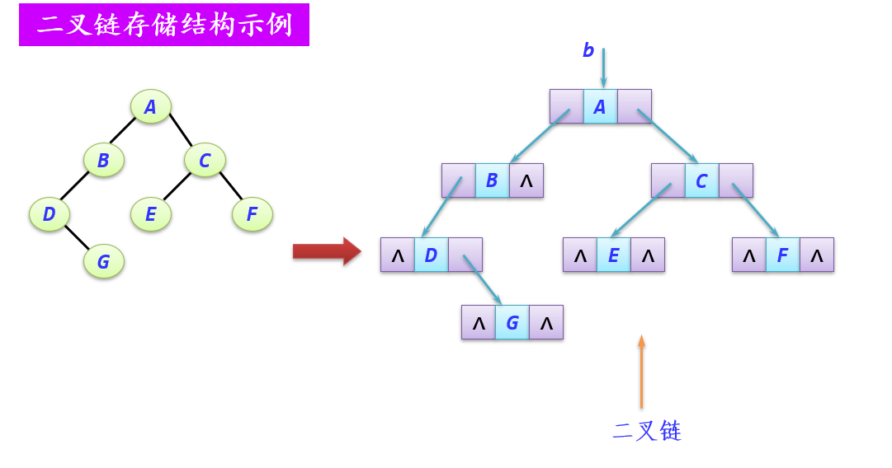

[TOC]
# 树

## 树的基本概念
### 定义
**递归定义**：树是由$n(n\geq0)$个结点（或元素）组成的有限集合（记为$T$）。
- 如果$n=0$，它是一棵空树，这是树的特例
- 如果$n>0$，这$n$个结点中有且仅有一个结点作为树的根结点，简称为根（root），其余结点可分为$m(m\ge0)$个互不相交的有限集$T_1,T_2,\dots,T_m$，其中每个子集本身又是一棵符合本定义的树，称为根结点的子树

==递归==定义刻画了==树的固有特性==：==即一棵树由若干棵互补相交的子树构成，而子树又由更小的若干棵子树构成==

**形式化定义（二元组）**：树：$T=\{D，R\}$。$D$是包含$n$个结点的有限集合$（n≥0）$。
- 如果$n=0$，它是一棵空树
- 如果$n>0$
  - 有且仅有一个结点$d_0∈D$，它对于关系$R$来说没有前驱结点，结点$d_0$称作树的根结点
  - 除根结点外，每个结点有且仅有一个前驱结点
  - $D$中每个结点可以有零个或多个后继结点

### 逻辑表示方式
1. 树形表示法
2. 文氏图表示法
3. 凹入表示法
4. 括号表示法


### 基本术语
1. **结点的度与树的度**：
   1. 树中一个**结点的子树个数**称为该**结点的度**
   2. 树中**各结点的度的最大值**称为**树的度**
   3. **通常将度为$m$的树称为$m$次树或者$m$叉树**。    
2. **分支结点与叶子结点**：
   1. **度不为零的结点**称为非终端结点，又叫**分支结点**
      1. **度为1**的结点称为**单分支结点**；
      2. **度为2**的结点称为**双分支结点**，依此类推
   2. **度为零的结点**称为终端结点或叶结点（或**叶子结点**）
3. **路径和路径长度**：
   1. 两个结点$d_i$和$d_j$的结点序列$（di,di_1,di_2,\dots,d_j）$称为路径
   2. 路径长度等于路径所通过的结点数目减1（即路径上分支数目），其中<dx，dy>是分支
4. **孩子结点、双亲结点和兄弟结点**：
   1. 一棵树中，**结点$N$的后继**，**称作$N$的孩子结点**。
   2. **相应地，$N$被称作孩子结点的双亲结点**。
   3. $N$的**孩子结点之间互为兄弟结点**。
5. **子孙结点和祖先结点**：
   1. 一棵树中，$N$的**所有子树中的结点称为该结点的子孙结点**
   2. **从根$R$到达结点$X$的路径上经过的所有结点被称作$X$的祖先结点**
6. **结点层次和树的高度**：
   1. 树中的每个结点都处在一个层次上。结点的层次从树根开始定义，根结点为第1层，它的孩子结点为第2层，以此类推，一个结点所在的层次为其双亲结点所在的层次加1
   2. 树中结点的最大层次称为树的高度（或树的深度）
7. **有序树和无序树**：
   1. 若树中各结点的子树是按照一定的次序从左向右安排的，且相对次序是不能随意变换的，则称为有序树，否则称为无序树
   2. 一般情况下，无特殊说明，默认为有序树
8. **森林**：$n（n>0）$个互不相交的树的集合称为森林

### 树的性质
1. <span style="color:red">树中的结点数等于所有结点的度数之和+1
   1. 结点个数表示：$n$为总结点个数，$n_i$为度为$i（0≤i≤m）$的结点个数
   2. $n=n_0+n_1+\dots+n_m$
   3. 所有结点度之和$ = n_1+2n_2+\dots+mn_m = n-1$
2. <span style="color:red">度为$m$的树中第$i$层上最多有$m^{i-1}$个结点（$i\ge1$）
3. <span style="color:red">高度为$h$的$m$次树最多有$\frac{m^h-1}{m-1}$个结点
4. <span style="color:red">具有$n$个结点的$m$次树的最小高度$\lceil \log_{m} (n(m-1)+1) \rceil$
   1. 对于$n$个结点，构造$m$次树为满$m$次数或者接近$m$次树，此时树的高度最小
   2. 对于$m$次树，除了某一层含有$m$个结点外，均只有一个结点，此时树的高度最大

### 树的基本运算
- 寻找满足某种特定条件的结点，如找双亲结点
- 插入或删除某个结点
- 遍历树中的所有结点
  1. **先根遍历**：先访问根结点，再从左到右先根遍历根结点的每一课子树
  2. **后根遍历**：先从左到右后根遍历根结点的每一课子树，再访问根结点
  3. **层次遍历**：从根结点开始，从上到下，从左到右的次序访问每个结点

### 树的存储结构
1. **双亲存储结构**：很容易找到双亲结点，但是找孩子结点的时候，要遍历整个存储结构
```C++
typedef struct 
{
   ElemType data;	//结点的值
   int parent;	//指向双亲的位置
} PTree[MaxSize];    
```

2. **孩子链存储结构**：很容易找到孩子结点，但是不容易找到双亲结点，而且当树的度较大时存在较多的空指针域
```C++
typedef struct node
{
   ElemType data;		      	//结点的值
   struct node *sons[MaxSons];	//指向孩子结点
} TSonNode;
```

n个结点的m次树有$n*m-(n-1)=n(m-1)+1$个空指针域
3. **孩子兄弟链存储结构**：最大优点是方便地实现将树变为二叉树，但是也不容易找到双亲结点
```C++
typedef struct tnode {
   ElemType data;		//结点的值
   struct tnode *hp;  	//指向兄弟
   struct tnode *vp;  	//指向孩子结点
} TSBNode;
```


## <span style="color:red">二叉树
### 定义
**二叉树**：是一个有限的结点集合，这个集合或者为空，或者由一个根结点和两棵互不相交的称为左子树和右子树的二叉树构成
**与2次树的区别**：
- 度为2的树中至少有一个结点的度为2，而二叉树没用这种要求
- 度为2的树不区分左、右子树，而二叉树是严格区分左、右子树的

**<span style="color:red">满二叉树**：如果所有分支结点都有双分结点；并且叶结点都集中在二叉树的最下一层
**<span style="color:red">特点：叶子结点都在最下一层；只有度为0和度为2的结点；高度为h的二叉树恰好有$2^h-1$个结点**

**<span style="color:red">完全二叉树**：最多只有下面两层的结点的度数小于2；并且最下面一层的叶结点都依次排列在该层最左边的位置上
**<span style="color:red">特点**：
- <span style="color:red">叶子结点只可能在最下面两层中出现；
- <span style="color:red">对于最大层次中的叶子结点，都依次排列在该层最左边的位置上；
- <span style="color:red">如果有度为1的结点，只可能有一个，且该结点只有左孩子而无右孩子；
- <span style="color:red">按层序编号时，一旦出现编号为$i$的结点是叶子结点或只有左孩子，则编号大于$i$的结点均为叶子结点；
- <span style="color:red">当结点总数$n$为奇数时，$n_1=0$，当结点总数$n$为偶数时，$n_1=1$


### 性质
1. <span style="color:red">非空二叉树上叶结点数等于双分支结点数加1。即：$n_0=n_2+1$，$n_2=\frac{n-n_1-1}{2}$
2. <span style="color:red">非空二叉树的第$i$层上最多有$2^i-1$个结点（$i\ge1$）
3. <span style="color:red">高度为$h$的二叉树最多有$2^h-1$个结点（$h\ge1$）
4. <span style="color:red">完全二叉树性质（含n为结点）：
   1. 若$i \le \lfloor n/2 \rfloor$，则编号为$i$的结点为分支结点，否则为叶结点
   2. 除树根结点外，若一个结点的编号为$i$，则它的双亲结点的编号为$\lfloor i/2 \rfloor$
   3. 编号为 i 的结点：
      1. 若有左孩子结点，则左孩子结点的编号为2i；
      2. 若有右孩子结点，则右孩子结点的编号为2i+1
   4. 当结点总数$n$为奇数时，$n_1=0$，每个分支结点都有左、右孩子；
      当结点总数$n$为偶数时，$n_1=1$，编号最大的分支结点$\lfloor n/2 \rfloor$只有左孩子
   5. 具有$n(n>0)$个结点的完全二叉树的高度为$\lceil \log_{2} (n+1) \rceil$或$\lfloor \log_{2} {n} \rfloor + 1$

### 二叉树与树、森林之间的转换
#### 森林、树转换为二叉树


#### 二叉树还原为树、森林



### 存储结构
#### 顺序存储（一般二叉树不采用，较适合完全二叉树）
```C++
typedef ElemType SqBTree[MaxSize]; //通常将下标为0的位置空着，空结点用#值代替
```

#### 链式存储（对于一般二叉树，节省空间，又操作方便）
```C++
typedef struct node
{
    ElemType data;        //数据元素
    struct node *lchild;  //指向左孩子结点  
    struct node *rchild;  //指向右孩子结点
}BTNode;
```

n个结点的二叉树有$n*2-(n-1)=n+1$个空指针域

### 二叉树的基本运算、遍历及构造
见``BTNode.cpp``
### 二叉树的递归应用
见``二叉树\应用``