[TOC]
# 内排序
## 排序的基本概念
排序：整理表中的记录，使之按关键字递增（或递减）有序排列（为指明的话，按递增来）
**排序的稳定性**：经过排序后，具有相同关键字的元素之间的相对次序保持不变，则说明这种排序方法是稳定的，反正，则不稳定
**内排序和外排序**：
1. 在排序过程中，若整个表都是放在内存中处理，排序时不涉及数据的内、外存交换，则称之为内排序；
2. 反之，若排序过程中要进行数据的内、外存交换，则称之为外排序

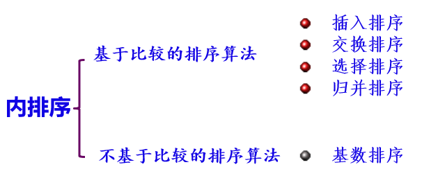

**基于比较的排序算法的性能分析**：
排序算法的性能由算法的时间和空间确定，而**时间是由==比较==和==移动==的次数确定**

## 插入排序
``内排序\插入排序.cpp``
### 直接插入排序
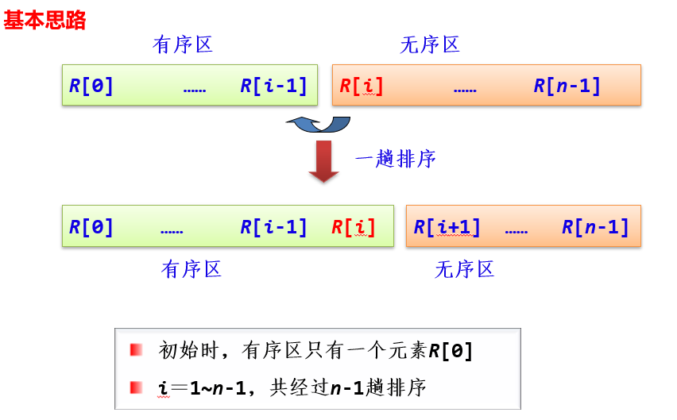
这里的有序区是局部有序区
### 折半插入排序
由于前边是有序区，可以通过折半法找到插入位置，减少了比较次数
### 希尔排序
实际上是分组的插入排序
步骤：
1. \( d=n/2 \)
2. 将排序序列分为 \( d \) 个组，在各组内进行 **直接插入排序**
3. 递减 \( d=d/2 \)，重复②，直到 \( d=1 \)
过程：
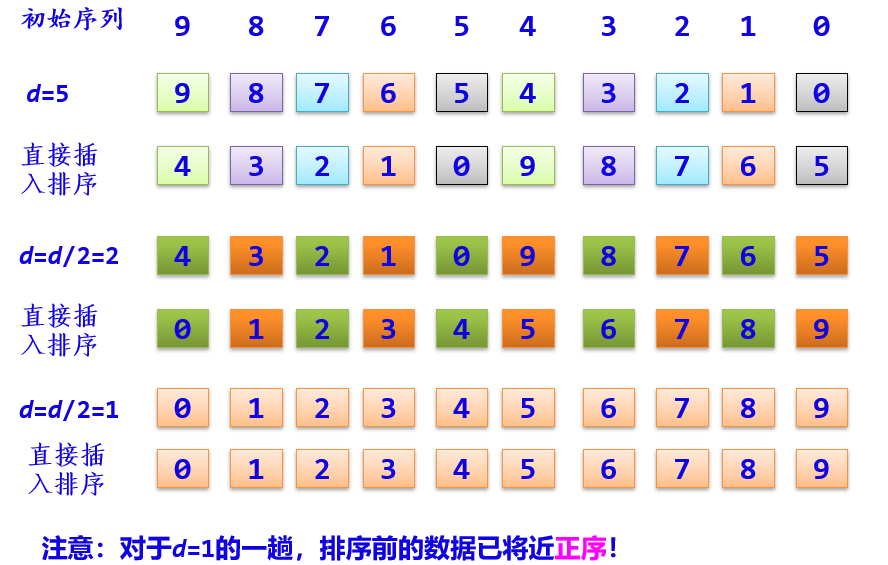

## 交换排序
``内排序\交换排序.cpp``
### 冒泡排序
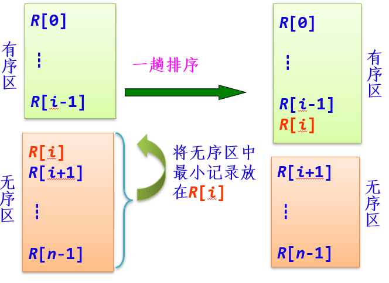
这里的有序区是全局有序
### 快速排序（递归）
基本思路：不断对划分之后的区域再划分
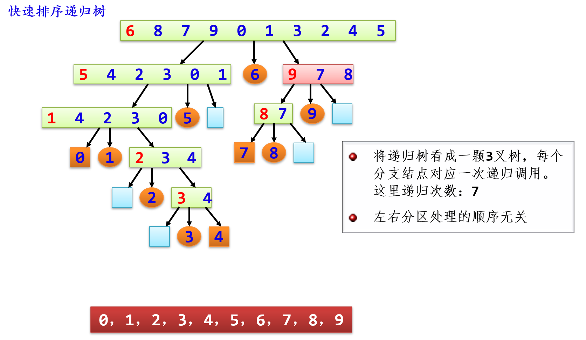

## 选择排序
``内排序\简单选择排序.cpp`` ``内排序\Heap.cpp``
### 简单选择排序
比较次数多，但是转移次数少

### 堆排序
#### 堆
**优先队列**：假定每个数据元素都包含一个关键值，称为对象的优先级，**按照优先级(重要性)来组织数据元素被称为优先队列**——<u>也就是数据元素插入队尾后，会根据其优先级排到相应位置，而不是必须在队尾</u>
**优先队列的存储实现——堆**：可以用一棵完全二叉树来描述
1. 堆是一个有限序列：H ={ h[1], h[2],… h[n-1] }；
2. 基本有序：
$h_i≤h_{2i} \text{且}   h_i≤h_{2i+1} \\
\text{或}\quad h_i≥h_{2i}  \text{且} h_i≥h_{2i+1} \ (1≤i≤\lfloor n/2 \rfloor)$
根据≥或≤ ，堆分为大顶堆和小顶堆。
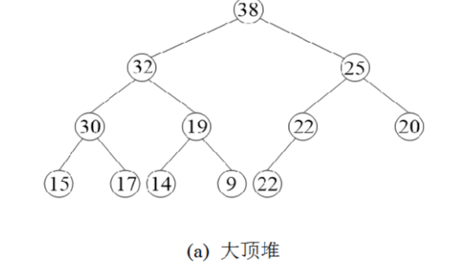

**堆的基本运算**：
1. 建堆：插入法和筛选法
   1. 插入法：需要每次自下而上，并不高效
   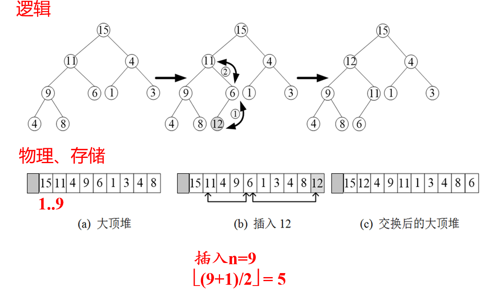
   2. 筛选法：自上而下筛下去，可以利用递归，较为高效
   步骤：
       1. **将所有n个已知的关键值保存到数组中，此时形成也许不满足堆特性的完全二叉树**；
       2. **每个叶子结点已经是堆**，
          所以**从最后一个内部结点**（该结点位于完全二叉树的倒数第二层，**在数组中的位置为⌊n/2⌋**）开始，**用筛选法从右至左从下到上依次调整每个内部节点，直到到达根结点，整棵完全二叉树就成为一个堆**
    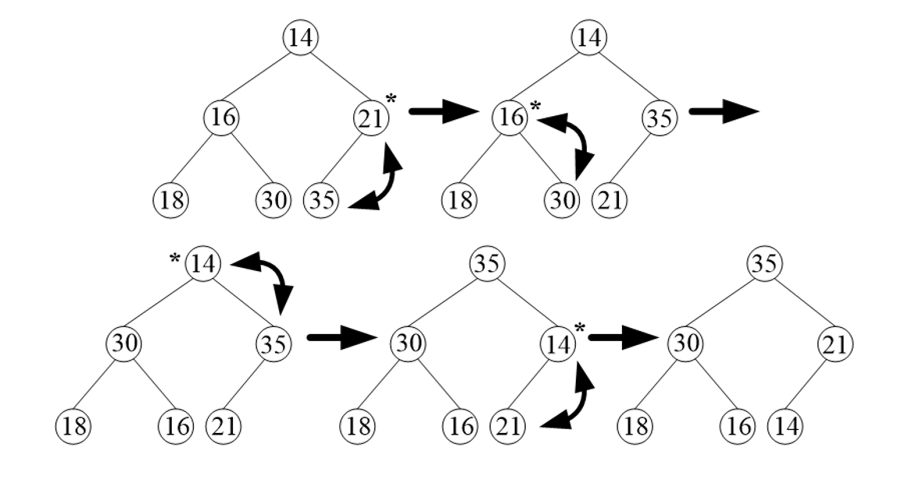
2. 删除：**只考虑删除根结点**——优先队列
做法：**删除根结点后，用最后一个元素替代根结点，再通过筛选算法 SiftDown 来保持堆的特性**
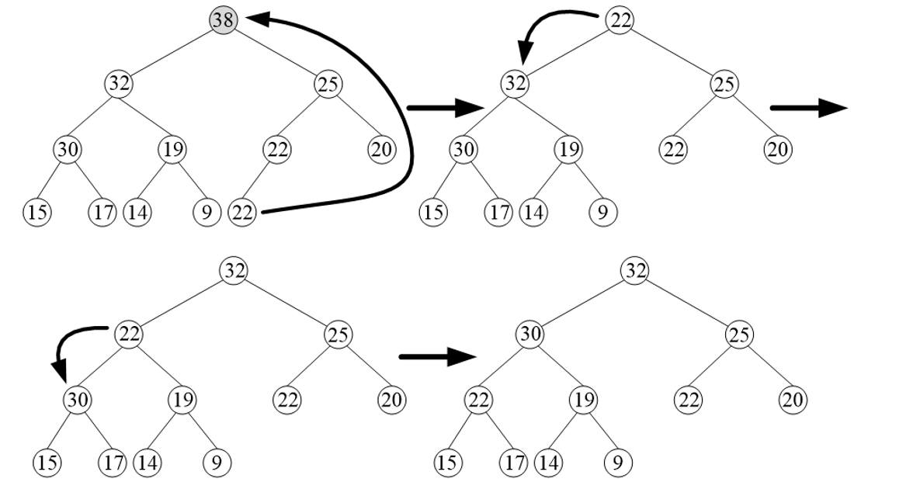
3. 性能分析：
   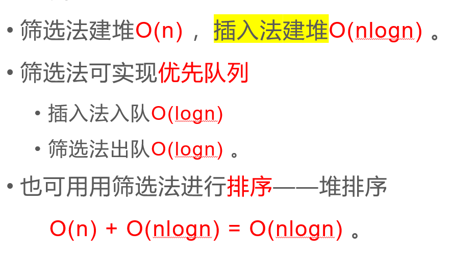

#### 堆排序算法
基本思路：每一次大顶堆的堆顶都是当前数组中最大的元素
步骤：
1. **将完全二叉树，通过筛选法变成堆**
2. **筛洗法出队，堆顶元素放到数组最后，再筛选建堆**
3. 重复第2步，直到只剩根结点
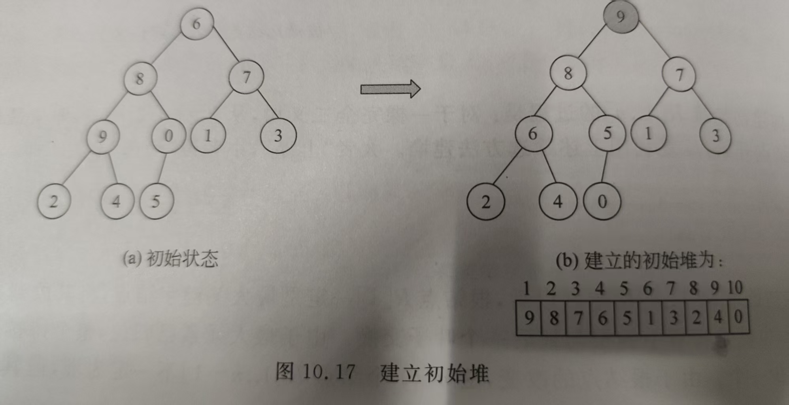
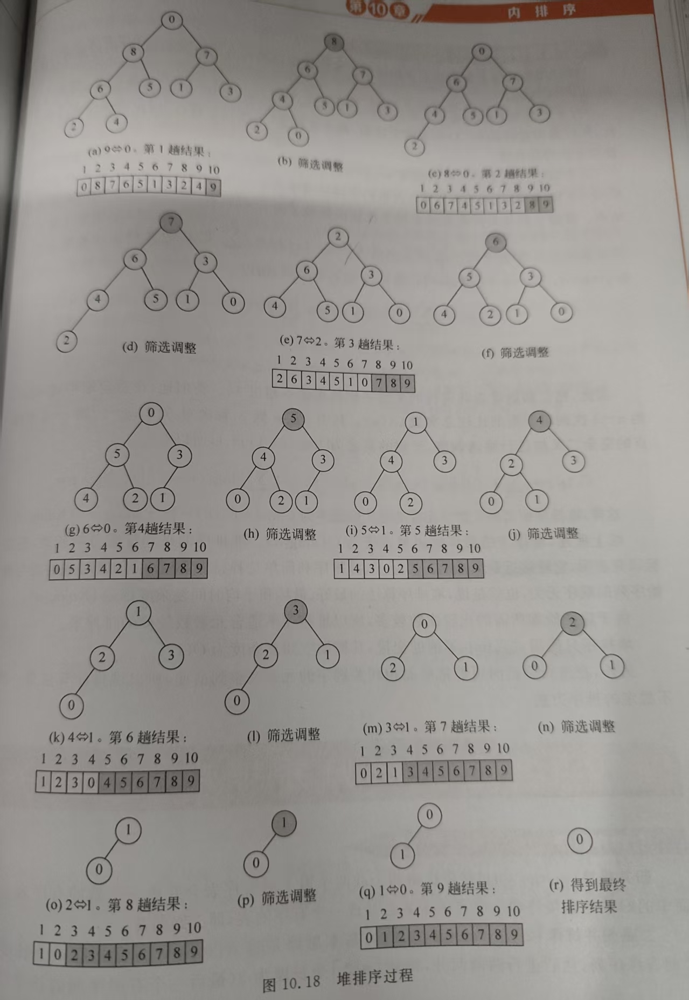

## 归并排序
``内排序\归并排序.cpp``
此处主要分析二路归并排序：==**多次将相邻两个的有序表合并成一个新有序表的排序方法**==，是最简单的归并排序
**核心**：两个有序表的归并，通过临时分配一个表R1，每次从两个有序表里取出一个元素进行比较，较小的放入R1，最后将各段中余下的部分直接复制到R1，再将R1复制回R
**问题**：在进行一次二路归并时
- 子表的个数可能为奇数：最好一个子表无须和其他子表归并，轮空
- 子表的个数可能为偶数：要注意最好一对子表中后一个子表的区间上界为n-1
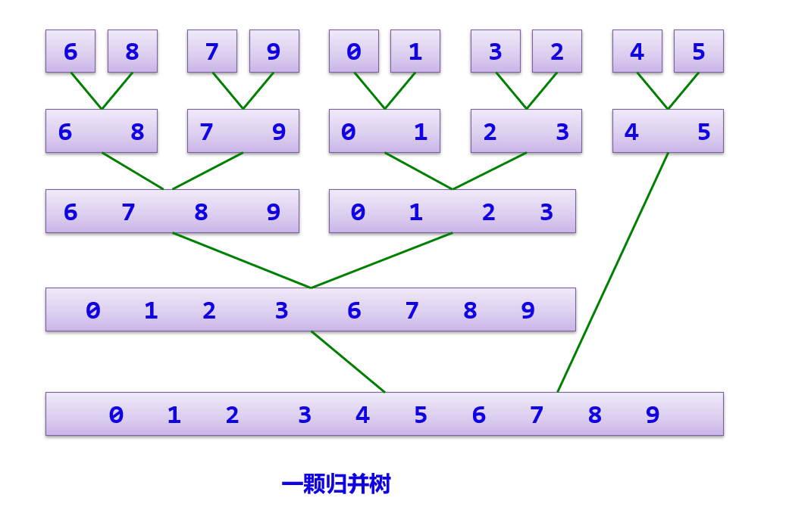

## 基数排序
无需比较，适合链表（移动较多）``内排序\基数排序.cpp``
**核心思想**：将整数按位数切割成不同的数字，然后按每个位数分别进行排序
**分类**：最低位优先（LSD）和最高位优先（MSD），**越重要的越放在后面排**——对于整数递增序列，采用最低位排序
**步骤**：依次对每一位进行**分配**和**收集**
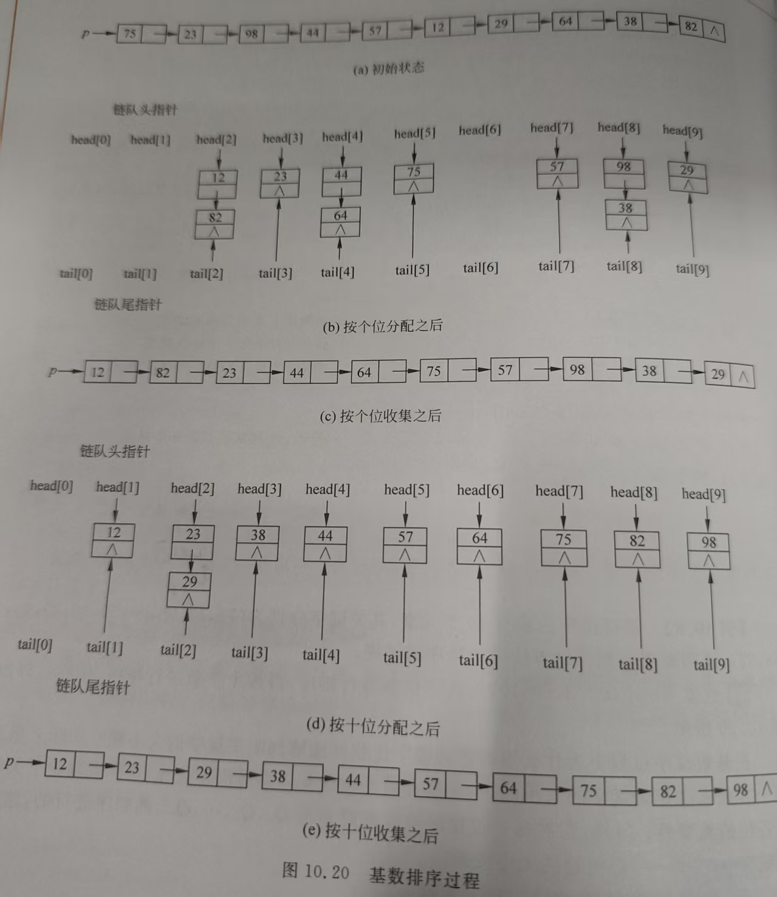

## 各性能分析
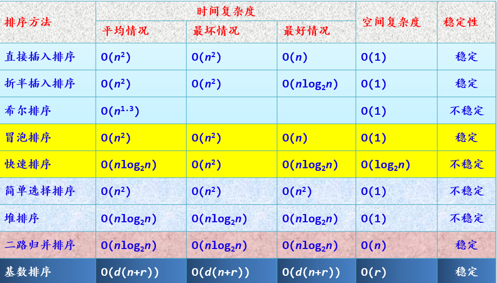
