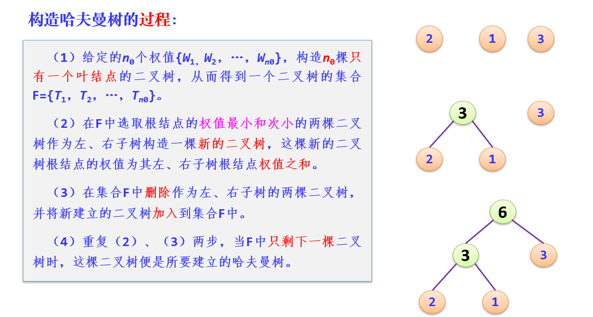
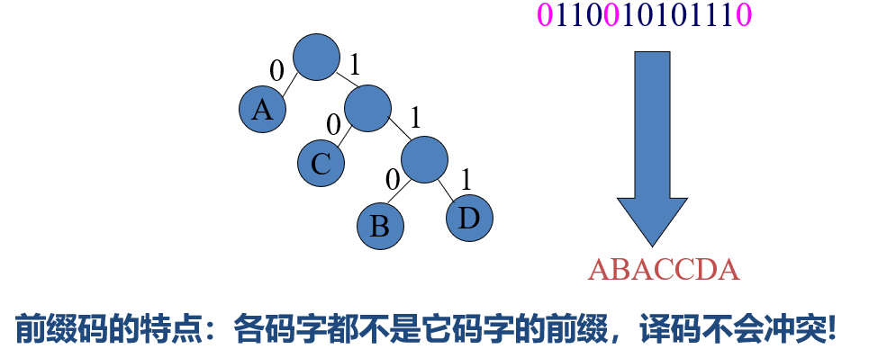
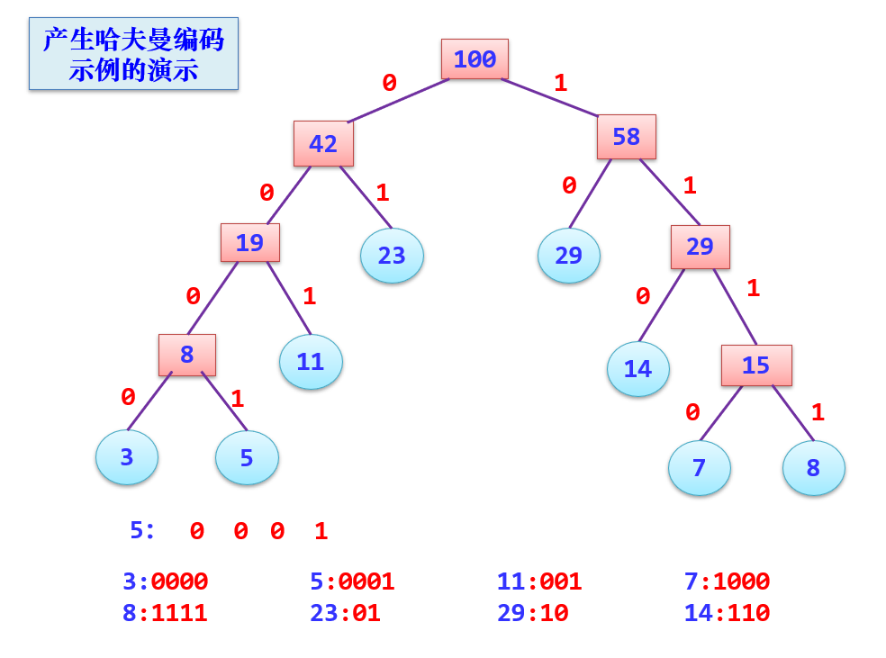

[TOC]
# 哈夫曼
## 哈夫曼树的概述
$WPL$：设二叉树具有n0个带权值的叶结点，那么从根结点到各个叶结点的路径长度与相应结点权值的乘积的和，叫做二叉树的带权路径长度WPL
通常记为：$WPL=\sum_{i=1}^{n_0}\omega_i l_i$
哈夫曼树（最优二叉树）：在$n_0$个带权叶子结点构成的所有二叉树中，带权路径长度WPL最小的二叉树

## 哈夫曼树的构造算法
原则：权值越大的叶结点越靠近根结点，权值越小的叶结点越远离根结点。

**定理**：对于具有$n_0$个叶子结点的哈夫曼树，共有$2n_0-1$个结点
**特点**：$n_1 = 0$：因为每次两棵树合并；$n = n_0+n_1+n_2  =  n_0+n_2 = 2n_0-1$

## 哈夫曼编解码
原则：出现次数较多的字符采用尽可能短的编码
关键：要设计的编码必须使任一字符的码字都不是另一个字符的码字的前缀——前缀编码
**哈夫曼编码的译码过程**：
分解接收字符串：遇“0”向左，遇“1”向右；一旦到达叶子结点，则译出一个字符，反复由根出发，直到译码完成

**哈夫曼编码的编码演示**：

