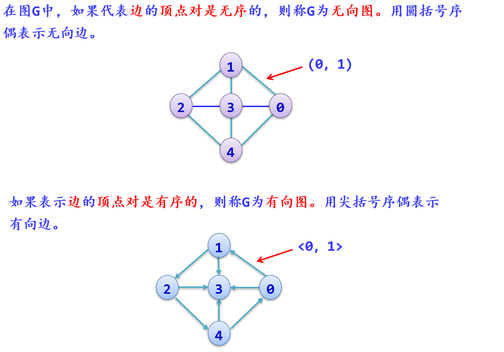
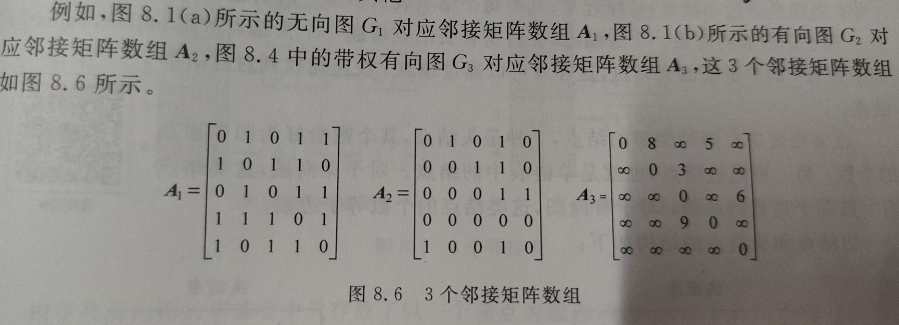
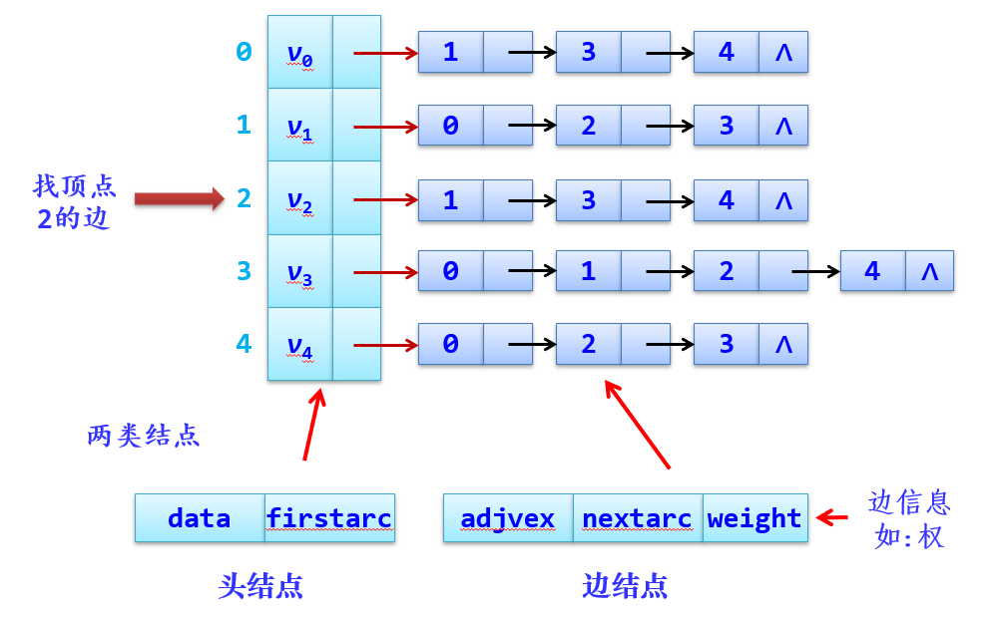
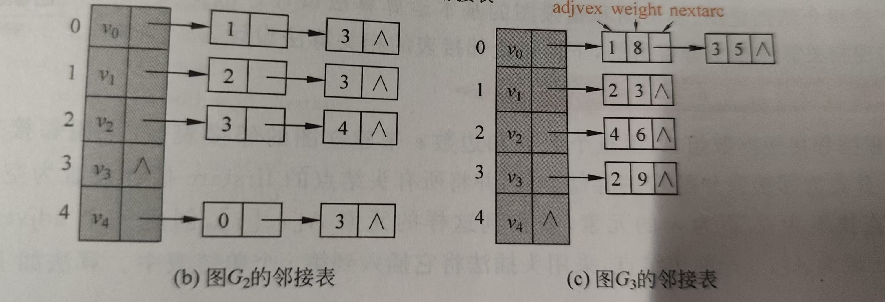
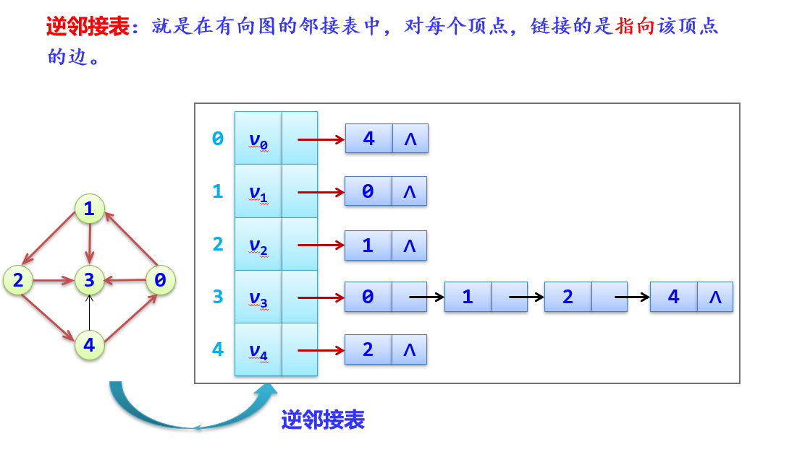
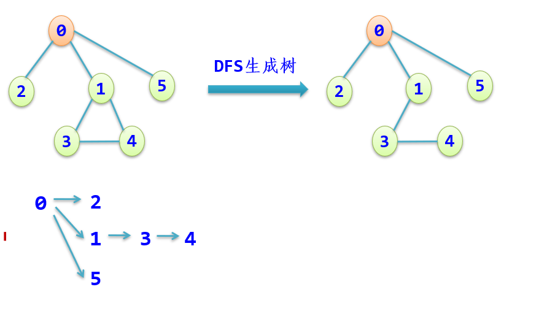
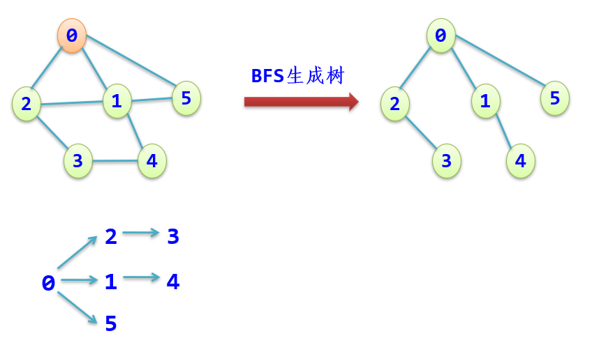
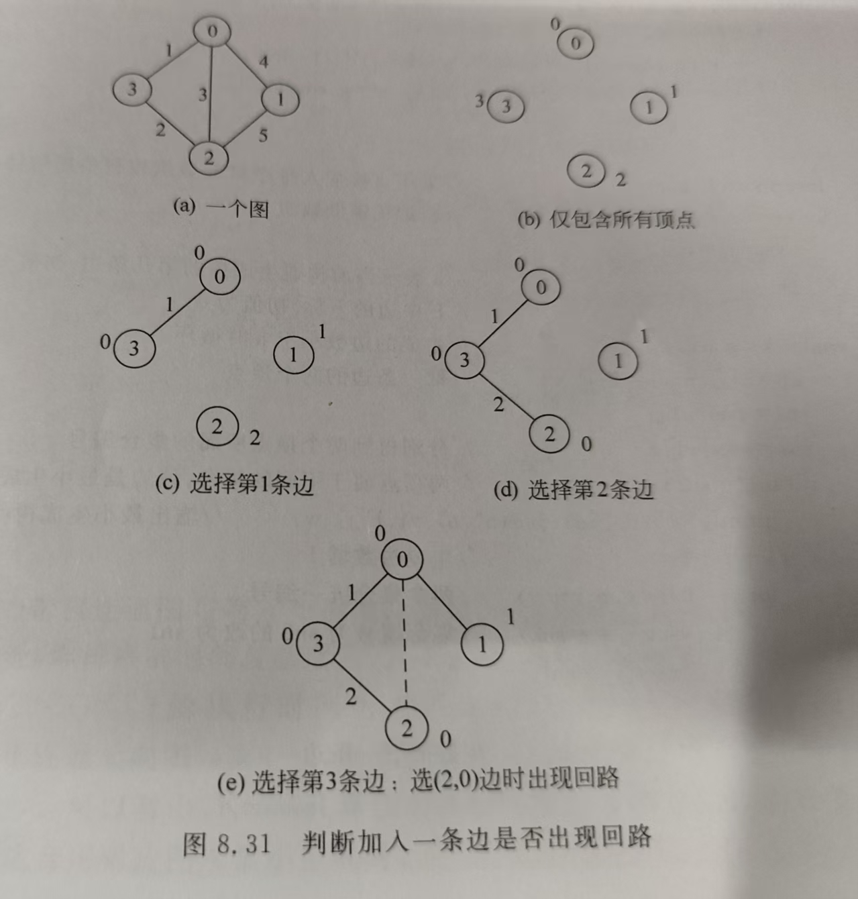
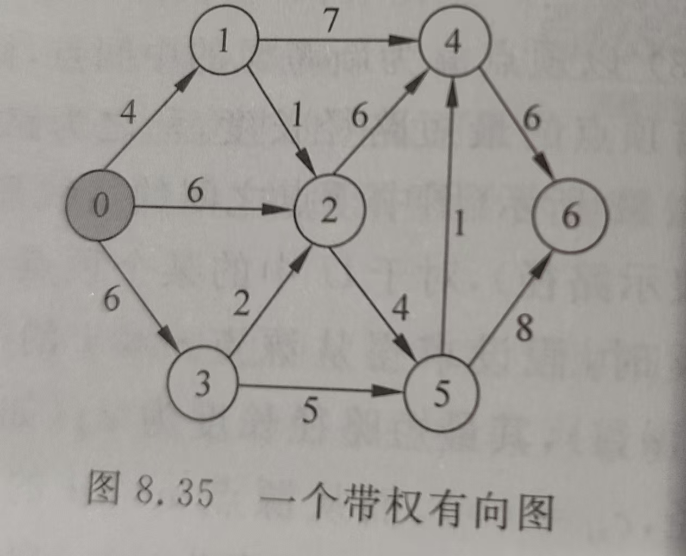
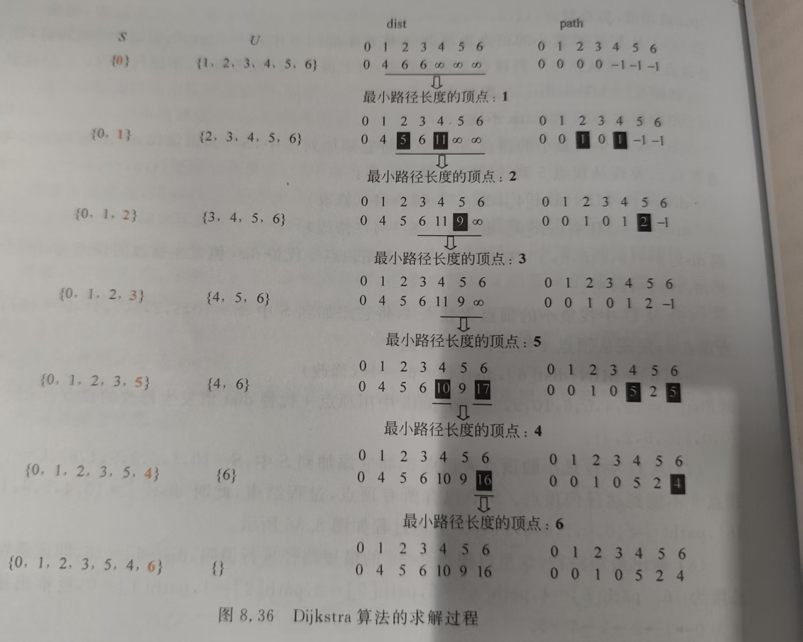

[TOC]
# 图论（简单图）

## <span style="color:gray">基本概念
**定义**：图$G$由两个集合$V$和$E$组成，<span style="color:red">记为$G=(V,E)$</span>，其中$V$是顶点的有限集合，记为$V(G)$，$E$是连接$V$中两个不同顶点（顶点对）的有限集合，记为$E(G)$
**分类**：有向图和无向图

**基本术语**：
1. **端点和邻接点**：
   1. 无向图中，若存在一条边$(i，j) \Rightarrow$ 顶点$i$和顶点$j$为端点，它们互为邻接点
   2. 有向图中，若存在一条边$<i，j> \Rightarrow$ 顶点$i$为起始端点（简称为起点），顶点$j$为终止端点（简称终点），它们互为邻接点
2. **顶点的度、入度和出度**：
   1. 无向图中，以顶点i为端点的边数称为该顶点的度   
   2. 有向图中，以顶点i为终点的入边的数目，称为该顶点的入度；以顶点i为始点的出边的数目，称为该顶点的出度，<u>一个顶点的入度与出度的和为该顶点的度</u>
   3. 若一个图中有$n$个顶点和$e$条边，每个顶点的度为$d_i（0≤i≤n-1）$，则有：$e=\frac{1}{2}\sum_{i=0}^{n-1}d_i$
3. **完全图**：
   1. 无向图中，每两个顶点之间都存在着一条边，称为完全无向图， 包含有$n(n-1)/2$条边。
   2. 有向图中，每两个顶点之间都存在着方向相反的两条边，称为完全有向图，包含有$n(n-1)$条边
4. **稠密图和稀疏图**：
   当一个图接近完全图时，则称为稠密图
   相反，当一个图含有较少的边数（即当$e \ll n(n-1)$）时，则称为稀疏图
5. **子图**：设有两个图$G=(V，E)$和$G'=(V'，E')$，若$V'$是$V$的子集，即$V'\in V$，且$E'$是$E$的子集，即$E'\in E$，则称$G'$是$G$的子图
6. **路径和路径长度**：
   1. 在一个图$G=(V，E)$中，从顶点$i$到顶点$j$的一条路径$(i,i_1,i_2,\dots,i_m,j)$。其中，所有的$(i_x，i_y) ∈E(G)$，或者$<i_x，i_y> ∈E(G)$
   2. 路径长度是指一条路径上经过的边的数目
   3. 若一条路径上除开始点和结束点可以相同外，其余顶点均不相同，则称此路径为<u>简单路径</u>
7. **回路或环**：若一条路径上的开始点与结束点为同一个顶点，则此路径被称为回路或环。<u>开始点与结束点相同的简单路径被称为简单回路或简单环</u>
8. **连通、连通图和连通分量**：无向图中，
    1. 若从顶点$i$到顶点$j$有路径，则称顶点$i$和$j$是连通的  
    2. 若图中任意两个顶点都连通，则称为连通图，否则称为非连通图。
    3. 无向图$G$中的极大连通子图称为$G$的连通分量。显然，任何连通图的连通分量只有一个，即本身，而非连通图有多个连通分量
9. **强连通图和强连通分量**：有向图中，
   1.  若从顶点$i$到顶点$j$有路径，则称从顶点$i$到$j$是连通的
   2. 若图$G$中的任意两个顶点$i$和$j$都连通，即从顶点$i$到$j$和从顶点$j$到$i$都存在路径，则称图$G是强连通图
   3. 有向图$G$中的极大强连通子图称为$G$的强连通分量。强连通图只有一个强连通分量，即本身。非强连通图有多个强连通分量
   4. <u>在一个非强连通图中找强连通分量的方法</u>：
      1. 在图中找有向环
      2. 扩展该有向环：如果某个顶点到该环中任一顶点有路径，并且该环中任一顶点到这个顶点也有路径，则加入这个顶点
10. **权和网**：
    1.  图中<u>每一条边都可以附带有一个对应的数值，这种与边相关的数值称为权</u>。<u>权可以表示从一个顶点到另一个顶点的距离或花费的代价</u>
    2. <u>边上带有权的图称为带权图，也称作网</u>

## 存储结构
### 邻接矩阵
$G$的邻接矩阵$A$是$n$阶方阵，其定义如下：
1. 无向无权图
\[
A[i][j] = 
\begin{cases} 
1 & \text{若 } (i,j) \in E(G) \\
0 & \text{其他}
\end{cases}
\]
2. 有向无权图
\[
A[i][j] = 
\begin{cases} 
1 & \text{若 } \langle i,j \rangle \in E(G) \\
0 & \text{其他}
\end{cases}
\]
3. 带权无向图
\[
A[i][j] = 
\begin{cases} 
w_{ij} & \text{若 } i \neq j \text{ 且 } (i,j) \in E(G),\text{ 该边的权为 } w_{ij} \\
0 & i = j \\
\infty & \text{其他}
\end{cases}
\]
4. 带权有向图
\[
A[i][j] = 
\begin{cases} 
w_{ij} & \text{若 } i \neq j \text{ 且 } \langle i,j \rangle \in E(G),\text{ 该边的权为 } w_{ij} \\
0 & i = j \\
\infty & \text{其他}
\end{cases}
\]
```C
//邻接矩阵存储
#define MAXV 50
#define INF 32767       //定义无穷
typedef struct            
{
    int no;             //顶点编号
    InfoType info;      //顶点的其他信息
}VertexType;            //顶点类型
typedef struct 
{
    int edges[MAXV][MAXV];  //邻接矩阵数组
    int n,e;                //顶点数和边数
    VertexType vex[MAXV];   //存放顶点信息
}MatGraph;                  //完整的邻接矩阵定义
```

**特点**：
- 邻接矩阵表示是唯一的
- 存储空间是$O(n^2)$，所以适合存储边的数目比较多的稠密图
- <u>无向图的邻接矩阵一定是对称矩阵，所以可以采用只存放上（或下）三角部分的元素，来压缩存储</u>
- *对于无向图，邻接矩阵数组的第$i$行或第$i$列非零元素，非$∞$元素的个数正好是顶点$i$的度*
- *对于有向图，邻接矩阵数组的第$i$行（或第$i$列）非零元素，非$∞$元素的个数正好是顶点$i$的出度（或入度）*
- <u>在邻接矩阵中，判断图中两顶点之间是否有边或者求两个顶点之间边的权的执行时间为$O(1)$</u>。*所以在需要提取边权值的算法中通常采用邻接矩阵的存储结构*

### 邻接表
邻接表是一种顺序分配与链式分配相结合的存储方法
```C++
//邻接表存储
typedef struct ANode
{
    int adjvex;             //该边的邻接点编号
    struct ANode *nextarc;  //指向下一条边的指针
    int weight;             //该边的相关信息，如权值
}ArcNode;                   //边节点类型
typedef struct Vnode
{
    InfoType info;          //顶点的其他信息
    ArcNode *firstarc;      //指向第一个边结点
}VNode;                     //头节点类型
typedef struct 
{
    VNode adjlist[MAXV];    //邻接表数组
    int n, e;               //图的顶点数n和边数e
}AdjGraph;                  //完整的图邻接表类型
```
　

**特点**：
- 邻接表的表示不唯一
- 对于无向图，有$n$个头结点和$2e$个边界点；对于有向图，有$n$个头结点和$e$个边界点；$\Rightarrow$ <u>特别适合于稀疏图存储</u>
- 对于无向图，邻接表中顶点$i$对应的第$i$个单链表的边结点数目正好是顶点$i$的度
- *对于有向图，邻接表中顶点$i$对应的第$i$个单链表的边结点数目仅仅是顶点$i$的出度，顶点$i$的入度为邻接表中所有$adjvex$域值为$i$的边结点数目*
- 在邻接表中，查找顶点$i$关联的所有边是非常迅速的，所以<u>在需要提取某个顶点的所有邻接点的算法中通常采用邻接表存储</u>
### 逆邻接表（仅作了解）
 

## 基本运算、图的遍历及应用
基本运算和遍历见 ``图论\graph.cpp``
应用见 ``图论\应用``

## 最小生成树——克鲁斯卡尔算法
### 生成树
**定义**：一个<u>连通图</u>的生成树是一个<u>极小连通子图</u>，它含有图中全部$n$个顶点和构成一棵树的$(n-1)$条边 $\Rightarrow$ **如果在一棵生成树上添加一条边，必定构成一个环**
**BFS tree**：由广度优先遍历得到的生成树

**DFS tree**：由深度优先遍历得到的生成树

连通分量：对于非连通图，需要多次调用遍历过程，每次调用得到的顶点集连同相关的边就构成了一个图的连通分量
生成森林：对于非连通图，每个连通分量中的顶点集和遍历时走过的边一起构成一棵生成树，各个连通分量的生成树组成非连通图的生成森林

### 最小生成树
**定义**：图的所有生成树中具有边上的权值之和最小的树
**<span style="color:red">克鲁斯卡尔算法**</span>：构造最小生成树（U,TE）
1. 置U的初值等于V（即包含有G中的全部顶点），TE的初值为空集（即图T中每一个顶点都构成一个连通分量）。
2. 将图G中的边按权值从小到大的顺序依次选取：
    1. 若选取的边未使生成树T形成回路，则加入TE；
    2. 否则舍弃，直到TE中包含(n-1)条边为止

代码见 ``图论\Kruskal.cpp``
（堆排序（或快速排序）+并查集该进的话，Kruskal算法的时间复杂度为$O(e\log_{2}{e})$）
## 最短路径——Dijkstra算法
==**前提**==：若从源点$v$到某个顶点$j$的最短路径是$(v,\dots,a,\dots,u,j)$,即，在源点$v \to j$的最短路径上顶点$j$的前一个顶点是$u$，那么$(v,\dots,a,\dots,u)$一定是源点$v \to u$的最短路径
**步骤**：
设G=(V，E)是一个带权有向图， 把图中**顶点集合V分成两组**
- 第1组为**已求出最短路径的顶点集合**（**用$S$表示**，初始时$S$中只有一个源点，以后每求得一条最短路径$v,\dots,u$，就将$u$加入到集合$S$中，直到全部顶点都加入到$S$中，算法就结束了）
- 第2组为**其余未求出最短路径的顶点集合**（**用$U$表示**）
1. <span style="color:red">初始化</span>：**$S$只含源点即$S=\{v\}$**，$v$的最短路径为0。$U$包含除$v$外的其他顶点，**$U$中点$i$距离为边上的权值（若$v$与$i$有边$<v，i>$）或$∞$（若$i$不是$v$的出边邻接点）**
2. **从$U$中选取一个距离$v$最小的顶点$u$，把$u$加入$S$中**（该选定的距离就是$v \to u$的最短路径长度）
3. **以u为新考虑的中间点**，<span style="color:red">修改U中各顶点j的最短路径长度</span>：若从源点$v \to j（j∈U）$的最短路径长度（经过顶点$u$）比原来最短路径长度（不经过顶点$u$）短，则修改顶点j的最短路径长度
\[
dist(j) = 
\begin{cases} 
W(v,u)+W(u,j) & \text{若} W(v,u)+W(u,j)< W(v,j) \\
W(v,j) & \text{否则}
\end{cases}
\]
4. 重复步骤 2 和 3 直到所有顶点都包含在S中



**特点**： 
1. 按顶点进入S的先后顺序，最短路径长度越来越长
2. 一个顶点一旦进入S后，其最短路径长度不再改变（调整）
3. Dijkstra算法不适合负权值的情况
代码见 ``图论\应用\图论—广度优先算法应用\src\Dijkstra.cpp``

## 拓扑排序：在有向图中找一个拓扑序列的过程
**拓扑序列**：设$G=(V，E)$是一个具有$n$个顶点的有向图，$V$中顶点序列$v_1,v_2,\dots,v_n$称为一个拓扑序列
**必须满足**：若$<i，j>$是图中的边（或从顶点$i\to j$有一条路径），则在拓扑序列中顶点$i$必须排在顶点$j$之前
**步骤**：
1. 从有向图中选择一个没有前驱（即入度为0）的顶点并且输出它
2. 从图中删去该顶点，并且删去从该顶点发出的全部有向边
3. 重复上述两步，直到剩余的图中不再存在没有前驱的顶点为止
代码见 ``图论\拓扑排序.cpp``