[TOC]

# 查找
## 查找的基本概念
**查找表**：一组记录，每个记录由若干个数据项组成，并假设每个记录都有一个能唯一标识该记录的关键字$key$
**查找**：给定一个关键字$k$，在含有$n$个元素的表中找出关键字等于$k$的元素。若找到，表示查找成功，返回该记录的信息或该记录在表中的位置；找不到，表示查找失败，返回相关的指示信息
**动态查找表**：在查找的同时对表做修改操作（如插入和删除），则相应的查找表称为动态查找表
**静态查找表**：在查找中不设计表的修改操作，则相应的查找表称为静态查找表
**内查找**：整个查找过程都在内存进行
**外查找**：查找过程中需要访问外存
<span style="color:red">平均查找长度（$ASL$）</span>：查找过程中执行的关键字平均比较个数——查找运算时间主要花费在关键字比较上，$ASL$是衡量一个查找算法效率优劣的标准
\[
ASL = \sum_{i=1}^{n}p_i c_i
\]

1. $n$是查找表中记录的个数。
2. $p_i$是查找第$i$个记录的概率，一般地，认为每个记录的查找概率相等，即$p_i=1/n(1≤i≤n)$。
3. $c_i$是找到第$i$个记录所需进行的比较次数
4. $ASL$分为：$ASL_{成功}$ 和 $ASL_{不成功}$

## 线性表的查找
线性表主要有顺序和链式两种存储结构
这里以顺序表作为存储结构实现线性表的查找算法——静态查找
```C++
typedef struct 
{
    KeyType key;    //关键字项
    InfoType data;  //其他数据类型
}RecType;           //查找元素的类型
```
代码实现见 ``查找\线性表的查找.cpp``，下面主要阐述原理和性能
### 顺序查找
从表的一端向另一端遍历
\[
ASL_{成功}=\frac{1}{n}\sum_{i=1}^{n}i=\frac{n+1}{2} \\
ASL_{不成功}=n
\]
### 折半查找
要求线性表中的记录必须己按关键字值有序（递增或递减）排列
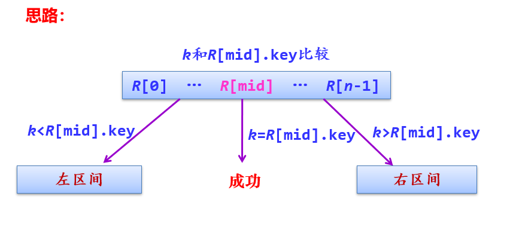
**判定树**（**比较树**）：
二分查找过程可用二叉树来描述：
- 把当前查找区间的中间位置上的记录作为根；
- 左子表和右子表中的记录分别作为根的左子树和右子树
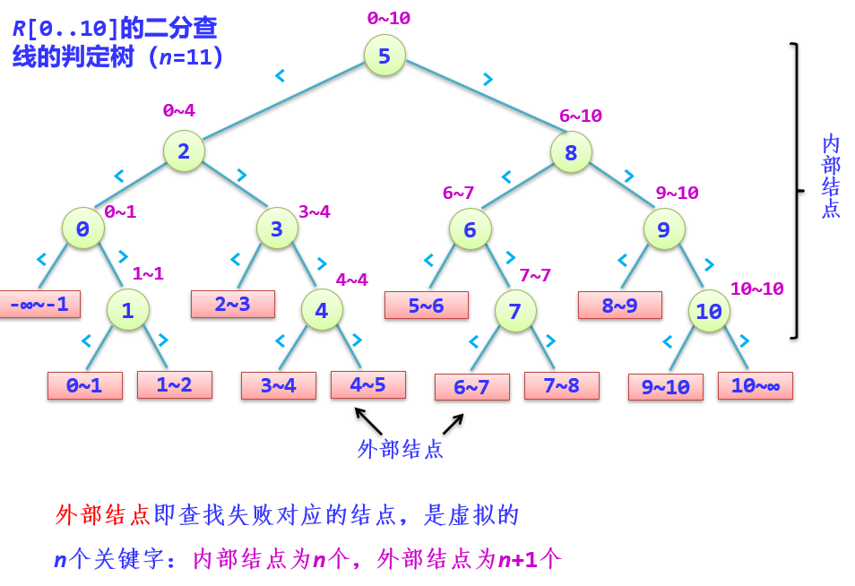
遂：
\[
ASL_{成功}=\sum_{i=1}^{n}p_i \times level(k_i)\\
ASL_{不成功}=\sum_{i=1}^{n}p_i \times (level(u_i)-1)\\
\]
折半查找一般情况分析：当n比较大时，将判定树看成内部结点总数$n=2^h-1$、高度为$h=\log_{2}(n+1)$的满二叉树（高度h不计外部结点）
在等概率假设下，二分查找成功时的平均查找长度为：
\[
ASL_{bn} = \sum_{i=1}^n p_i c_i 
        = \frac{1}{n} \sum_{j=1}^h 2^{j-1} \times j 
        = \frac{n+1}{n} \log_2(n+1) - 1 
        \approx \log_2(n+1) - 1  \\
ASL_{不成功} = h = \log_{2}(n+1)  \\
\text{时间复杂度为}O(\log_{2}n)
\]
## 索引表的查找
### 索引表的存储结构
索引存储结构 = 主数据表 + 索引表      
索引表中的每一项称为索引项，索引项的一般形式是：（关键字，地址）
关键字唯一标识一个记录，地址作为指向该关键字对应记录的指针，也可以是相对地址。 
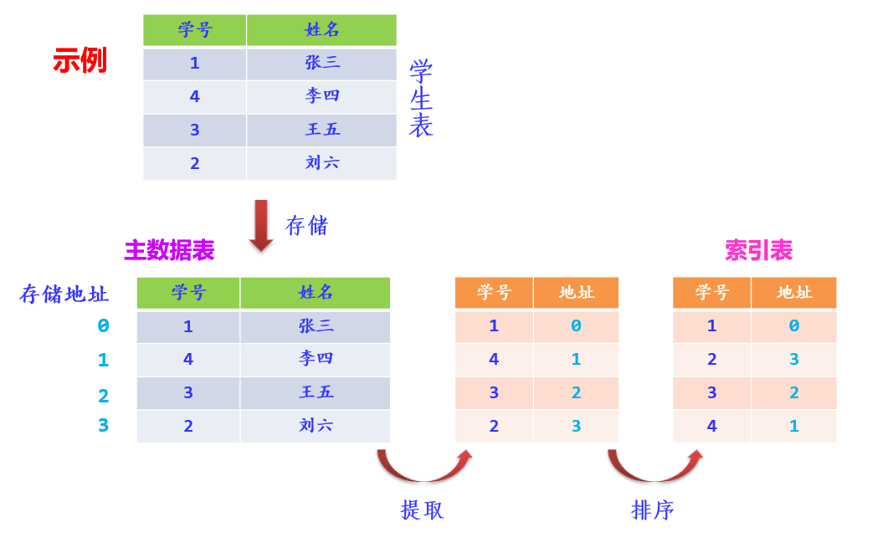
### 分块查找
性能介于顺序查找和折半查找之间，要求整个表分块有序
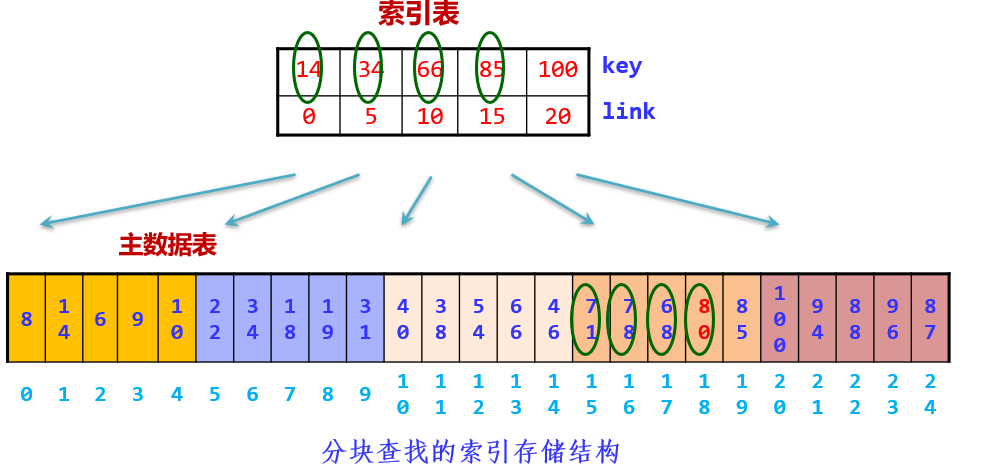
**过程**：
1. 在索引表（有序）中按关键字查找：可以顺序查找块，也可以二分查找块。
2. 在对应的数据块（无序）中查找：只能顺序查找块中元素。

代码实现见 ``查找\线性表的查找.cpp``
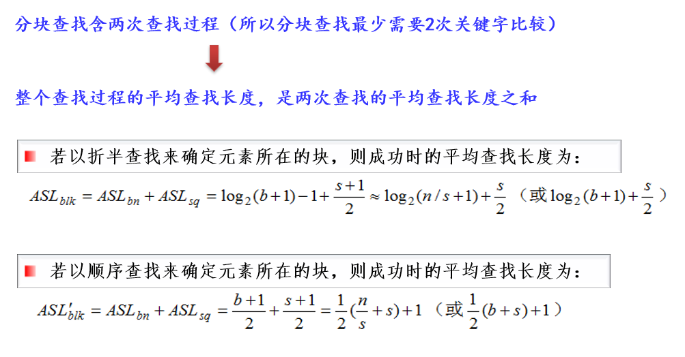
主要缺点：索引表的建立需要额外的空间和时间

## 树表的查找
- 以二叉树或其他树作为查找表的组织形式，称为树表。
- 树表主要采用链式存储结构。
- 这类存储结构不仅适合于查找，也适合于插入和删除操作，属于动态查找表。
### 二叉排序树（内查找）
**定义**：二叉排序树或者是空树，或者是满足如下性质（**BST性质**）的二叉树：
1. 若它的左子树非空，则**左子树上所有结点值（指关键字值）均小于根结点值**。
2. 若它的右子树非空，则**右子树上所有结点值均大于根结点值**。
3. **左、右子树本身又各是一棵二叉排序树**。

**注意**：二叉排序树中没有相同关键字的结点。
**特点**：
- 二叉排序树的中序序列是一个递增有序序列
- 根结点的最左下结点是关键字最小的结点
- 根结点的最右下结点是关键字最大的结点

```C++
typedef struct node
{
    KeyType key;                   
    InfoType data;
    struct node *lchild, *rchild;
}BSTNode;
```
代码见 ``查找\树表的查找.cpp``
$ASL$：类似折半法，但判定树是唯一的，BST不是
平均时间复杂度$O(\log_{2}n)$
具体求法：
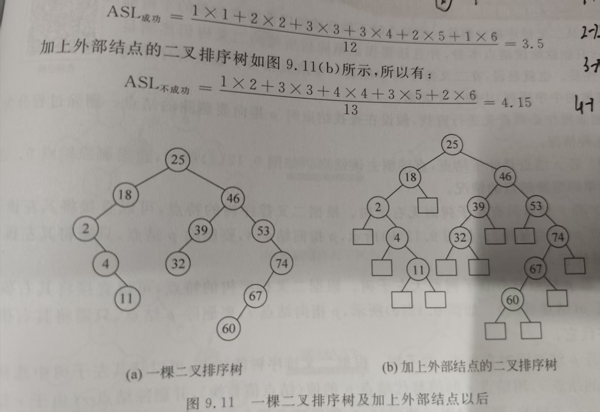
#### 平衡二叉树（仅作了解）
**定义**：若**一棵二叉树中每个结点的左、右子树的高度至多相差1**，则称此二叉树为平衡二叉树（AVL）
**平衡因子**：该结点左子树的高度减去右子树的高度
综上，**所有结点的平衡因子的绝对值小于或等于1，该二叉树称为平衡二叉树**
**平衡二叉树的插入**：
1. <span style="color:red">LL型调整</span>：A结点的左孩子的左子树插入结点，破坏了平衡
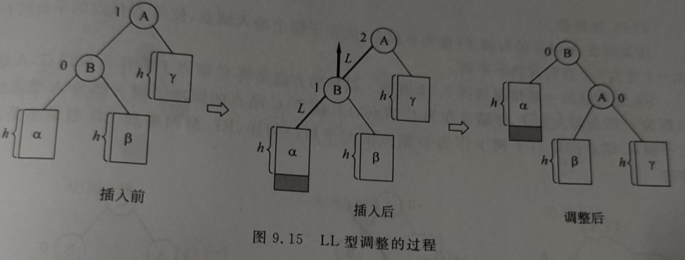
2. <span style="color:red">RR型调整</span>：A结点的右孩子的右子树插入结点，破坏了平衡
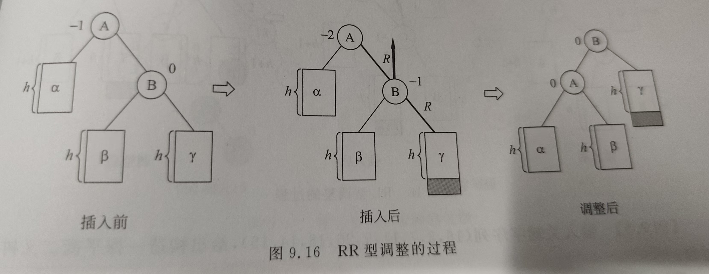
3. <span style="color:red">LR型调整</span>：A结点的左孩子的右子树插入结点，破坏了平衡
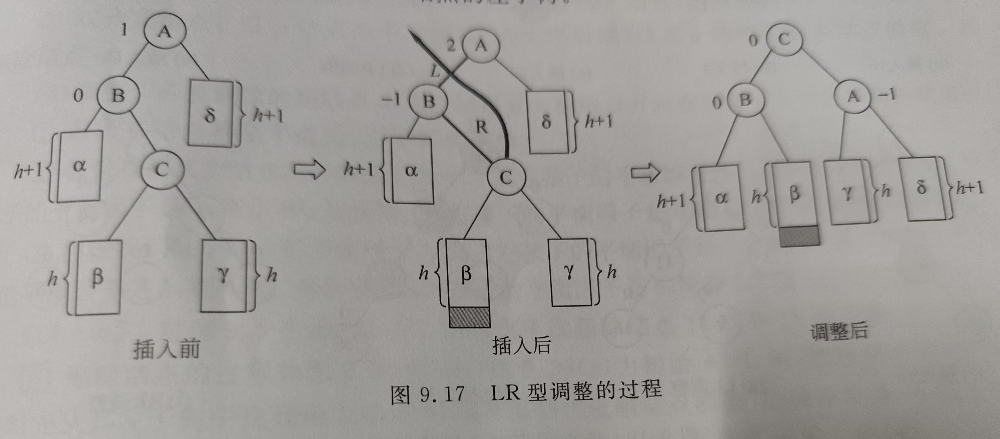
4. <span style="color:red">RL型调整</span>：A结点的右孩子的左子树插入结点，破坏了平衡
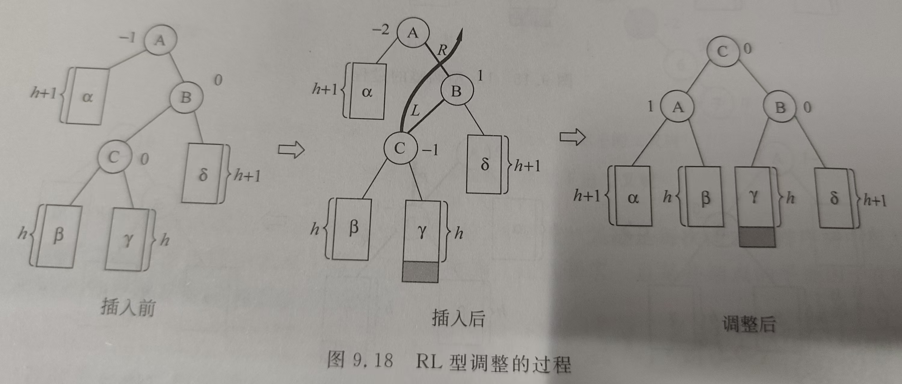

**平衡二叉树的删除**：先按二叉排序树删除，然后在按上述四种情况进行调整
**性能**：和折半查找一样
### B树（外查找）
B树又称为多路平衡查找树，是一种组织和维护外存文件系统非常有效的数据结构
**B树的阶**：B树中所有结点的孩子结点的最大值，通常用$m$表示，并且一般$m \ge 3$
**<span style="color:red">定义**：一棵m阶B树或者是一棵空树，或者是满足要求的m叉树： 
1. 树中每个结点至多有$m$个孩子结点（即**至多有$m-1$个关键字**，<span style="color:red">$Max = m-1$）
2. 若根结点不是叶子结点，则**根结点至少有两个孩子结点**
3. 除根结点外，其他非叶子结点至少有$\lceil m/2 \rceil$个孩子结点（即**至少有$\lceil m/2 \rceil-1$个关键字**，<span style="color:red">$Min =\lceil m/2 \rceil-1$）
4. 每个结点的结构如下，结点中按关键字大小顺序排列:
   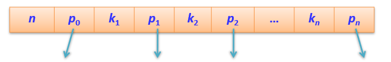
   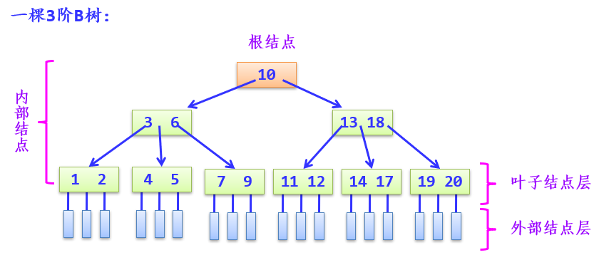
5. 所有**外部结点都在同一层**上。B树是**所有结点的平衡因子均等于0**的多路查找树
```C++
#define MAXM 10         //定义的最大阶数
typedef struct node
{
    int keynum;             //关键字个数
    KeyType key[MAXM];      //存放关键字，k[0]不用
    struct node *parent;    //双亲结点
    struct node *ptr[MAXM]; //孩子结点指针数组
}BTNode;
int m;  //m阶B_树，所有结点的孩子结点的最大值
int Max; //每个结点的最多关键字MAX=m-1
int Min; //每个结点的最少关键字Min=(m+1)/2-1
```
**B树的查找**：对于一个$m$阶B树来说，需要访问的结点个数不超过$log_{\lceil m/2 \rceil}{\frac{n+1}{2}}+1$，故时间复杂度为$O(\log_{m}n)$
**<span style="color:red">B树的插入**：
步骤：
1. 查找该关键字的插入结点（注意B树的插入结点一定是叶子结点层的结点）
2. 插入关键字k

情况：
1. 插入结点有空位置，即关键字个数$n<m-1$：直接把关键字k有序插入到该结点的合适位置上
2. 插入结点没有空位置，即原关键字个数n=m-1 $\Rightarrow$ 分裂
    1. 如果没有双亲结点，新建一个双亲结点，树的高度增加一层。
    2. 如果有双亲结点，将$\lceil m/2 \rceil$插入到双亲结点中
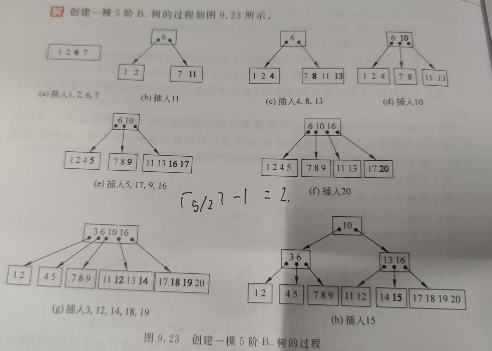

**<span style="color:red">B树的删除**：
步骤：
1. 查找关键字k所在的结点p
2. 在结点p中删除关键字k

情况：
1. 结点p为非叶子结点：在其子树里用仅次于它的来替代，或者仅大于它的来替代
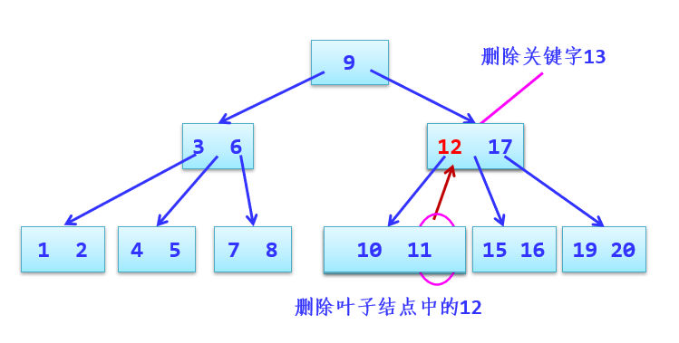
2. 结点p为叶子结点：
   1. 假如b结点的关键字个数大于$Min$，说明删去该关键字后该结点仍满足B树的定义，则可直接删去该关键字
   2. 假如b结点的关键字个数等于$Min$，说明删去关键字后该结点将不满足B树的定义。若可以从兄弟结点借
   
   3. 假如b结点的关键字个数等于Min，说明删去关键字后该结点将不满足B树的定义。若不能从兄弟结点借，与双亲结点中分割二者的关键字合并
   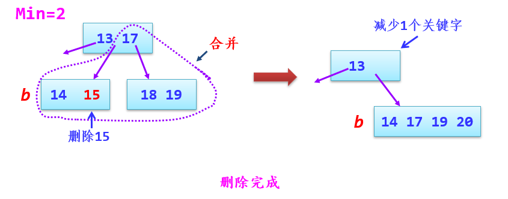
   
#### B+树
**定义**：一棵m阶B+树满足下列要求
1. 每个分支结点至多有m棵子树
2. 根结点或者没有子树，或者至少有两棵子树
3. 除根结点外，其他每个分支结点至少有$\lceil m/2 \rceil$棵子树
4. **有n棵子树的结点恰好有n个关键字**
5. **所有叶子结点包含全部关键字及指向相应记录的指针，而且叶子结点按关键字大小顺序链接**。并将所有叶子结点链接起来
6. **所有分支结点（可看成是索引的索引）中仅包含它的各个子结点（即下级索引的索引块）中最大关键字及指向子结点的指针**
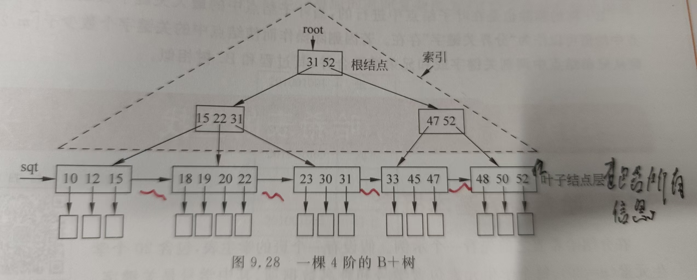

## 哈希表的查找
见 ``查找\哈希表的查找.cpp``
### 哈希表的基本概念
基本思想：记录的存储位置（**哈希地址**）与**关键字**之间存在对应关系
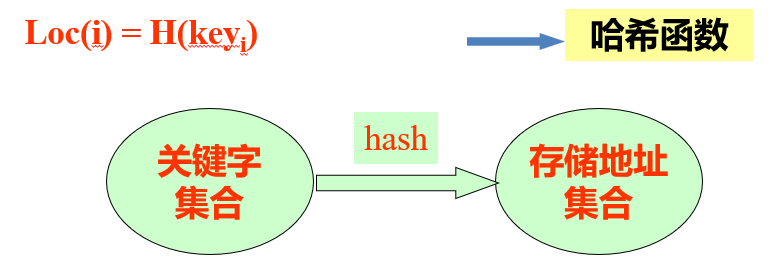
优点：**查找速度极快$O(1)$**，查找效率与元素个数n无关
问题：**哈希冲突**，即$k_1 \ne k_j$，而$h(k_i)=h(k_j)$，也成为同义词冲突
**装填因子**：==$\alpha = n/m$==,n为已存入元素，m为哈希地址空间大小。α**越小，冲突的可能性就越小，α越大（最大可取1），冲突的可能性就越大**，通常控制在0.6~0.9内
### 哈希函数的构造方法
1. 直接定址法
\[
h(k)=k+c    
\]
2. 除留余数法（适用范围广） 
\[
h(k)=k\bmod p  \\ 
\text{（p≤m，p取不大于m的素数效果最好）}
\]

### 哈希冲突的解决方法
1. **开放定址法**
   1. 线性探测法：简单，但容易发生非同义词冲突
\[
\begin{aligned}
& d_0 = h(k) \\
& d_i = (d_{i-1} + 1) \bmod m \quad (1 \leq i \leq m-1)
\end{aligned}
\]
结果示例
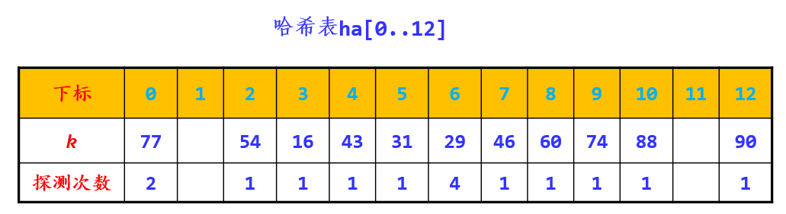
    2. 平方探测法：可以较好避免冲突，但不一定能探测到哈希表所有单元，最少能探测到一半单元
2. **拉链法**
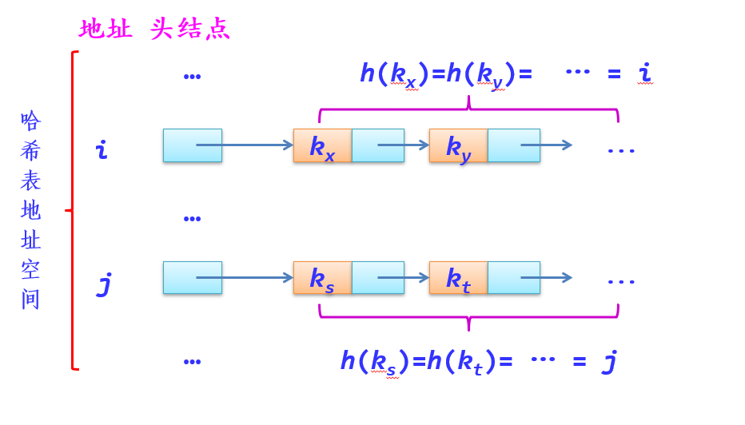 
优点：
- 处理冲突简单，且无堆积
- 结点空间是动态申请的
- 为减少冲突而开辟的空间要求更小
- 删除易于操作

**性能分析**：
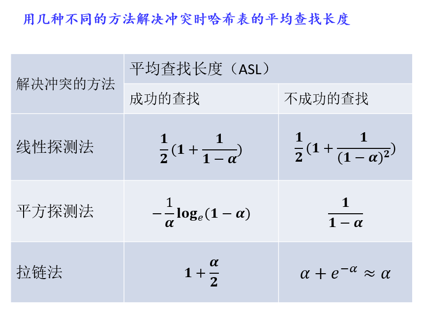

