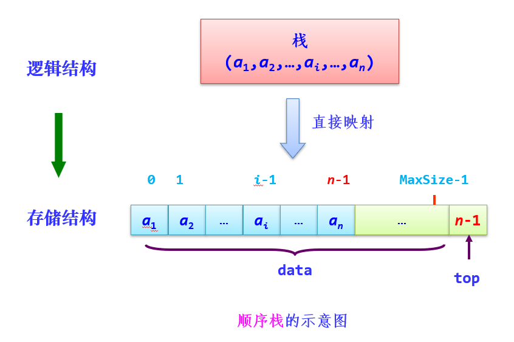
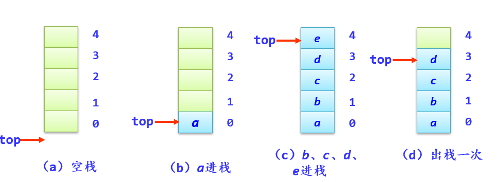
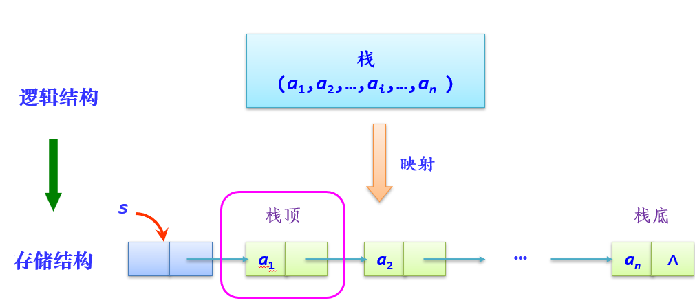
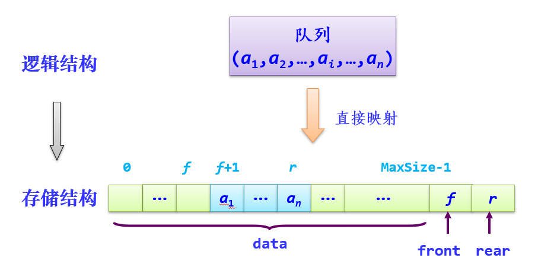
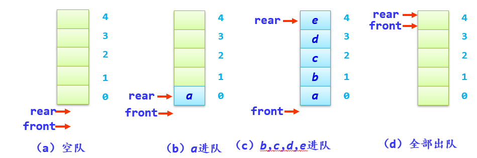
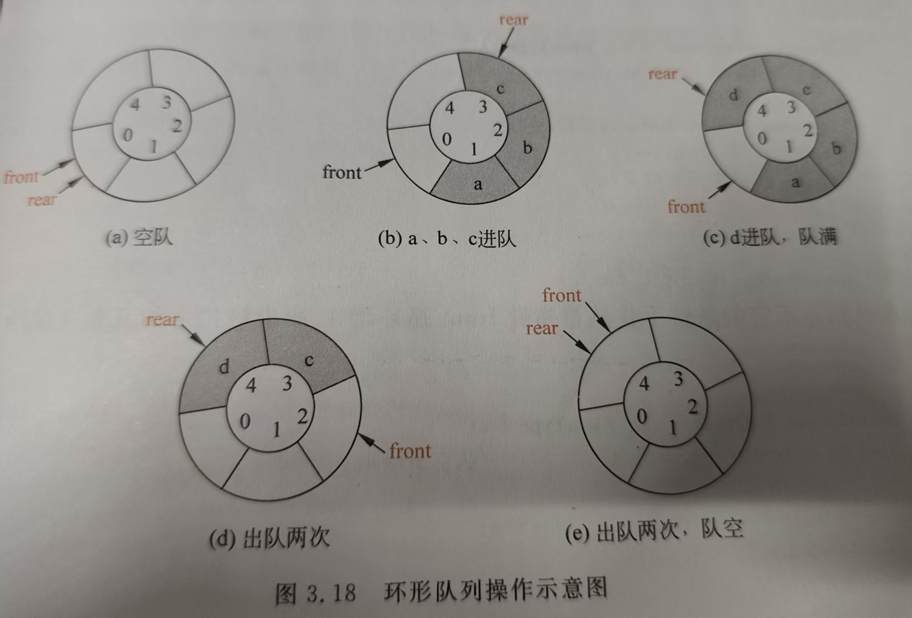
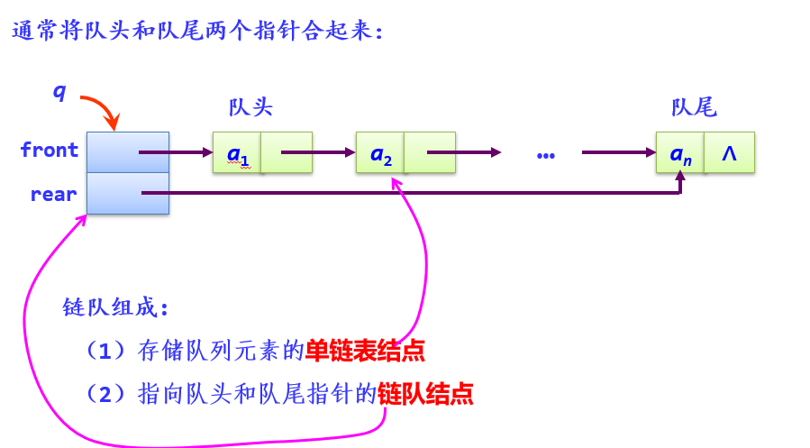

[TOC]

# 栈
## 栈的定义
**定义**：栈是一种==只能在一端进行插入或删除操作的线性表==
==**主要特点：后进先出**==
==**栈顶**：表中允许进行插入、删除操作的一端==
**栈底**：表的另一端
**空栈**：当栈中美誉数据元素时
**进栈**或**入栈（push）**：插入元素； **出栈**或**退栈（pop）**：删除元素

==注：n个不同的元素通过一个栈产生的出栈序列的个数为$ \frac{1}{n+1}C_{2n}^{n}$==

## 顺序栈
### 存储结构
```C++
typedef struct 
{
    ElemType data[MaxSize];  //存放栈中的数据元素  
    int top;                 //栈顶元素在data数组中的下标（栈顶指针）
}SqStack;                    //顺序栈的类型
```


### 基本运算
- **栈空的条件**：``s->top==-1``
- **栈满的条件**：``s->top==MaxSize-1 //(data数组的最大下标)``
- **元素e的进栈操作**：``s->top++; s->data[s->top]=e``
- **出栈操作**：``e=s->data[s->top];s->top--``

具体代码见``栈和队列\sqstack.cpp``

## 链栈
### 存储结构
```C++
typedef struct linknode
{
    ElemType data;          //数据域
    struct linknode *next;  //指针域
} LinkStnode;               //链栈的类型
```


### 基本运算
- **栈空的条件**：``s->next==NULL``
- **栈满的条件**：不存在栈满的情况（链栈的优势） 
- **元素e的进栈操作**：头插法
- **出栈操作**：``p=s->next; e=p->data; s->next=p->next; free(p)``

## 栈的应用
- **表达式中的括号、引号是否匹配成功**：见``栈和队列\应用\match.cpp``
- **简单表达式求值**: 见``栈和队列\应用\potsexp.cpp.cpp``
- **深度优先求解迷宫**: 见``栈和队列\应用\迷宫最短路径.cpp``

# 队列
## 队列的定义
**定义**: 队列是一种==仅允许在表的一端进行插入操作,而在表的另一端进行删除操作的线性表==
==**主要特点: 先进先出**==
**队尾**: 进行插入的一端
**队头**或**队首**: 进行删除的一端
**入队**或**进队**: 新元素到队尾
**出队**或**离队**: 队首元素出队,其直接后继元素成为新的队首元素
==注：进队顺序一定,出队顺序则只有一种==

## 顺序队
### 存储结构
```C++
typedef struct 
{
    ElemType data[MaxSize]; //存放队中元素
    int front, rear;        //队头和队尾指针
}SqQueue;                   //顺序队类型
```

### 基本操作
#### 非环形队列
- **队空的条件**: ``q->front==q->rear``
- **队满的条件**: ``q->rear==MaxSize-1 //(data数组的最大下标)`` 存在假溢出
- **元素e的进队操作**: ``q->rear++;q->data[q->rear]=e``
- **出队操作**: ``q->front++;e=q->data[q->front]``

**注: 在顺序队中, rear指向队尾元素；==front指向队头元素的前一个位置==**
#### 环形队列
- **队空条件**：``front == rear``
- **队满条件**：``(rear+1)%MaxSize == front``
- **进队e操作**：``rear=(rear+1)%MaxSize; q->data[q->rear]=e``
- **出队操作**：``front=(front+1)%MaxSize; e=q->data[q->front]``

**注: 队头指针front循环增1: ==$front = (front+1)\%MaxSize$== (队尾同理)**

## 链队
### 存储结构
```C++
typedef struct qNode {
    ElemType data;
    struct qNode *next;  //存放元素
} DataNode;              //链队的数据结点类型

typedef struct {
    DataNode *front;  // 队头指针
    DataNode *rear;   // 队尾指针
} LinkQueue;          // 链队列结构
```

### 基本操作
- **队空的条件**: ``q->rear==NULL``
- **队满的条件**: 不存在队满的情况（链队的优势）
- **元素e的进队操作**: 尾插法
- **出队操作**: ``t=Q->front; if(Q->front==Q->rear)  Q->front=Q->rear=NULL; else Q->front=Q->front->next; e = t->data; free(t);``

## 队的应用
- **广度优先求解迷宫(非环形队列)**
- **求解报数问题(环形队列)**
- **基数排序(链队)**
    