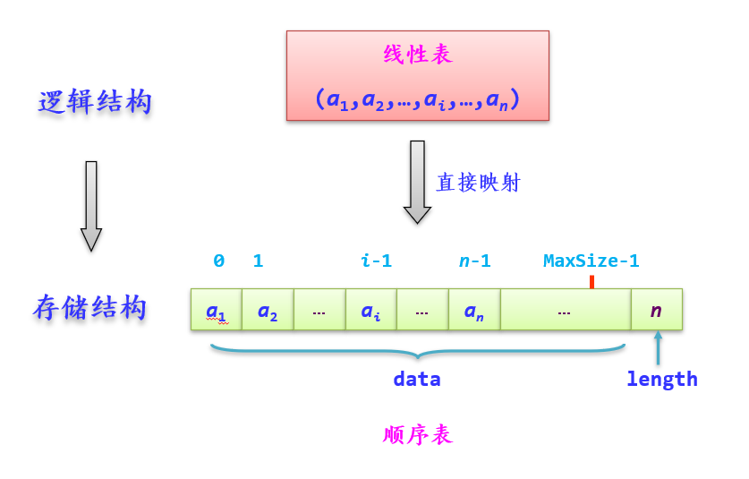
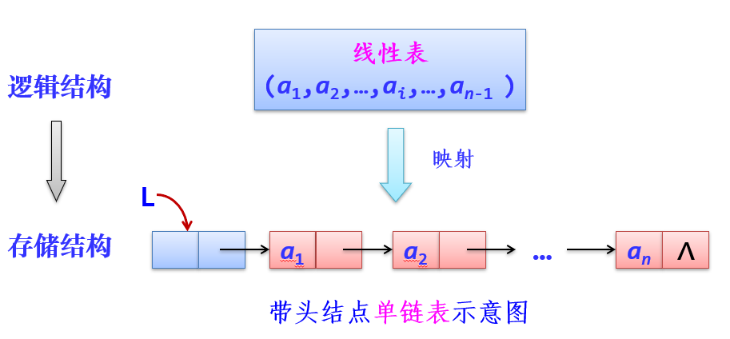
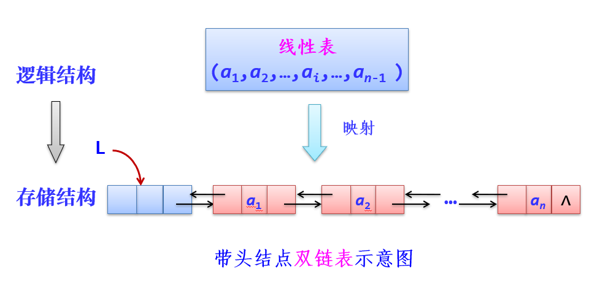

[TOC]
# 线性表
## 线性表的逻辑结构
==定义==：线性表是具有相同特性的数据元素的一个有限序列

==特性==：
1. 有穷性：元素个数有限
2. 一致性：所有元素性质相同
3. 序列性：所有元素之间的相对位置是线性的，即存在唯一的开始元素和终端元素，除此之外，每个元素只有唯一的前驱元素和后继元素

作用：一是可以作为存放数据的容器，二是可以使用它的基本运算来完成更复杂的功能
## 线性表的顺序存储结构——顺序表
定义：把线性表中的所有元素按照其逻辑顺序依次存储，到从计算机存储器中指定存储位置开始的一块连续的存储空间（直接映射）

 

注：==逻辑序号是从1开始，物理序号是从0开始==

==顺序表指针==：之所以采用，主要是为了==方便顺序表的释放算法设计==，并且在函数之间==传递顺序表指针时会节省形参分配的空间==

顺序表的运算函数见``线性表\sqlist.cpp``

应用：
1. 重建法：删除某些元素时，扫描顺序表，在原表上重建，只包含不等于那些元素的元素，时间：O(n)，空间：O(1)
2. ==划分==：相比于双指针的交换，移动元素的次数更少，时间：O(n)，空间：O(1)，详细见：``线性表\应用\划分.cpp``

## 线性表的链式存储结构——链表
定义：其中每个存储结点不仅包含元素本身的信息（==数据域==），还包含表示元素之间逻辑关系的信息（==指针域==）

分类：
1. **单链表**：只设置一个指针域，用于指向其后继结点

2. **双链表**：设置两个指针区域，分别指向前驱结点和后继结点

3. 循环链表：又分为循环单链和循环双联，做法：尾结点next指针域由原来的空改为指向头结点

**头指针**：每个链表都带有一个头结点，指向头结点的指针唯一标识该链表
**首指针**：指向首结点或者开始结点的指针
**尾指针**：指向尾结点的指针，一般``r-> = NULL``

**增加头结点的优点**：
1. 单链表中首结点的插入和删除操作与其他结点一致，无须进行特殊处理
2. 无论单链表是否为空都有一个头结点，因此统一了空表和非空表的处理过程

单链表的运算函数见``线性表\linknode.cpp``
双链表的运算函数见``线性表\dlinknode.cpp``
应用：利用链表的插入排序，见``线性表\应用\linknode应用.cpp``

## 链表和顺序表的比较
1. 顺序存储可以按位置直接存取数据元素(随机存取)，方便灵活，效率高；但插入、删除操作是将引起元素移动，降低了效率，故适用于线性表中元素数量基本稳定，且很少进行插入和删除，但要求以最快的速度存取线性表中的元素的情况；
2. 链式存储元素存储采用动态分配，利用率高，但需增设表示结点之间有序关系的指针域，存取数据元素不如顺序存储方便，但结点的插入、删除操作十分简单，故适用于频繁进行元素的动态 插入或删除操作的场合

**存储密度**：$存储密度 = \frac{结点中数据元素所占的存储量}{结点所占的存储量}$
顺序表的存储密度=1，而链表的存储密度<1，存储空间的利用率，顺序表更高
