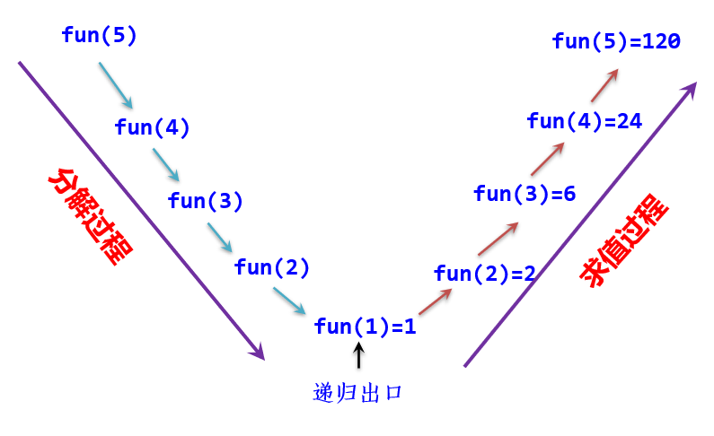
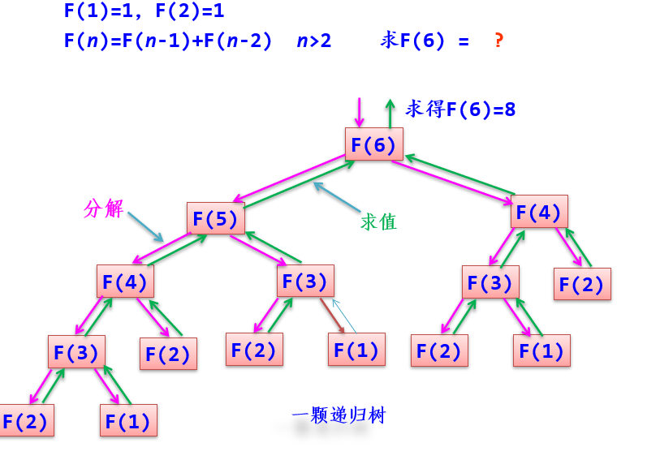
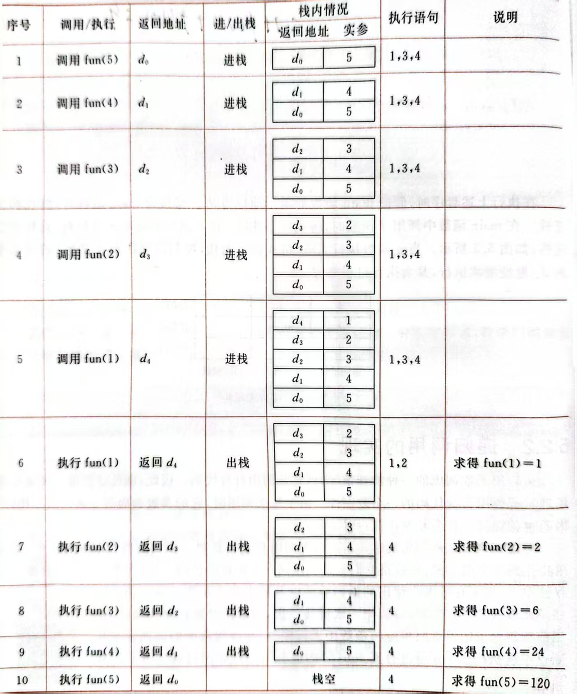

[TOC]
# 递归
## 基本概念
**定义**：在定义一个过程或函数时出现调用本过程或本函数的成分称为递归
**直接递归**：调用自身
**间接递归**：$p$调用$q$，而$q$又调用$p$
>任何间接递归算法都可以转换为直接递归算法来实现，故主要讨论直接递归

**尾递归**：一个递归过程或递归函数中的递归调用语句是最后一条执行语句
**条件**：
1. 需要解决的问题可以转化为若干个子问题来求解，而这些子问题的求解方法与原问题完全相同，只是在数量规模上不同
2. 递归调用的次数必须是有限的
3. 必须有结束递归的条件来终止递归

**优点**：结构简短，清晰，易读
**缺点**：算法执行中占用的内存空间较多，执行效率低，不容易优化
**需要递归的情况**：
1. **定义是递归的**：比如树，斐波那契数列
2. **数据结构是递归的**：比如单链表
3. **问题的求解方法是递归的**：比如树的一系列应用，Hanoi问题

**递归模型**：
$$
\begin{aligned}
& f(s_1)=m_1   \qquad \text{递归出口} \\
& f(s_n)=g(f(s_{n-1}),c_{n-1})     \qquad \text{递归体}
\end{aligned}
$$

## 函数调用栈
大多数CPU上的程序实现使用栈来支持函数调用操作
**栈帧**：<u>单个函数调用操作所使用的函数调用栈</u>，每次函数调用时都会**相应的创建一帧，保存返回地址、实参和局部变量等，并将该帧压入调用栈**
**递归调用的实现**：
这些调用在内部实现时，共享代码，**每次调用时，开辟一组存储单元，用来存放本次调用的返回地址以及被中断的函数的参数值**。这些单元以栈的形式存放，**每调用一次进栈一次，当返回时执行出栈操作，把当前栈顶保留的值送回相应的参数中恢复，并按栈顶中的返回地址从断点继续执行**
示例：

## 递归算法的设计
1. 对原问题进行分析，**假设出合理的小问题**
2. **假设小问题是可解的**，在此基础上确定大问题的解，即**给出小问题和大问题之间的联系**，也就是确定递归体
3. **确定一个特殊情况，作为递归出口**

>心得：一般一个特殊情况就算最小单元的小问题，然后搞清这个函数的功能（无需内容），用这个函数直接在那个特殊情况的基础上去解决再大一点的问题

例子：利用深度优先求解迷宫问题``图论\应用\图遍历算法的应用.cpp mazeDFS``